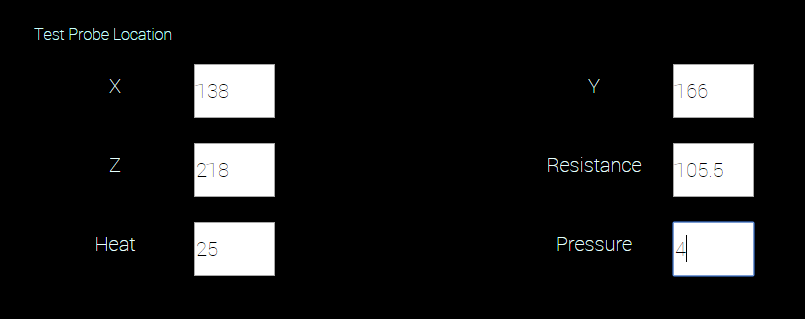

C-DEngine User Management (UM) Capabilities
======================================

*The purpose of this white paper is to describe the capabilities of the
C-DEngine as it relates to user management. User management systems
allows administrators to manage the devices, applications, databases,
networks and other resources which users can access. Any discussion of
user management must be interwoven with more than a passing
consideration of data security. Any compromise to the security of a user
management system can have far reaching impacts on an organization\'s
financial well-being, operational integrity, and reputation.*


Contents
========

+ [C-DEngine User Management Capabilities](#c-dengine-user-management-capabilities)
+ [C-DEngine Authentication and Authorization](#c-dengine-authentication-and-authorization)
+ [Authentication: Either Scope Id or User Id](#authentication-either-scope-id-or-user-id)
+ [Authorization: Natural Machine Interface Filter](#authorization-natural-machine-interface-filter)
+ [Example of ACL Applied to Controls](#example-of-acl-applied-to-controls)

C-DEngine Authentication and Authorization
------------------------------------------

We start this look at the C-DEngine user management capabilities by
discussing **authentication** and **authorization**, two topics at the
core of every user management system. Authentication is the process of
proving your identity. Within the C‑DEngine, there are two different
mechanisms for authenticating users. Authorization is the process of
providing permission for what you may and may not do. C-DEngine has very
fine-grained permission system in place.

### Authentication: Either Scope Id or User Id

Within any C-DEngine mesh, all of the nodes will use one of two
authentication mechanisms[^1]. One is a **scope id**, which is a shared
secret (or password). The other is a **user id/password** combination.
Figure 1 shows a prompt for a scope id (as in this example, a scope id
sometimes is called a \"security id\").


**\
Figure 1 Browser participation in a mesh using a ScopeID for debugging
purposes.**


#### When to use Scope ID vs User Manager

ScopeID login in general is very limted as all users share the same ScopeID but it is great during development as developer can focus on their business logic.
Most of the C-DEngine samples do use the ScopeID Login and Generate the ScopeID randomly or even set a fixed ScopeID by the developer.
Nodes that do not require user input or the NMI, can use ScopeID based security to connect the node/relay to other nodes in the mesh.

The UserManager requires a setting "UseUserMapper=true" in the configuration. Once turned on, it cannot be turned off anymore without deleting the ClientBin/cache and with it the UserDB.


In addition to its role in authenticating users, the C-DEngine uses the
scope id in node-to-node communication. Two nodes that share a common
scope id can communicate with each other. And two nodes with different
scope ids cannot. This is because the value of the scope id itself
provides one of the elements used to encrypt the context of messages
sent between nodes.

One important exception is a special class of nodes called \"cloud
nodes,\" which are stateless relays that are unscoped (meaning they do
not have a scope id). Cloud nodes route packets between nodes with the
same scope id..

This is important from a data security perspective. Organizations often
route data through systems that are not under their direct control. Such
systems can become compromised in a manner that may not be detected in a
timely manner. If such a situation should occur on a C-DEngine cloud
node, the issue is partly mitigated by the fact that there is no
unencrypted \"plain text\" for unauthorized third-parties to be able to
view (if the nodes communicate via SSL/TLS)


**Figure 2. Authentication with user id and password.**

The main user authentication method in the C-DEngine is by user id and
password (see Figure 2). The "First Node" (The node the browser is
connected to) validates the uid/pwd against its UM and then includes the
browser in the mesh by mapping the user to the ScopeID. The reason is
that the scope id plays an important role in securing data communication
channels. The scope id is still present and managed on the "First Node"
but it is not visible on, stored on or even sent to the browser.

The format of a user id (or \"username\", as it is called in Figure 2)
is an email address. This format was chosen because it is familiar to
most computer users and easy for automated systems to validate. It
should be noted that C-DEngine provides no \"lost password\" support.
This is because the primary environment for which C-DEngine is targeted
are clusters of systems that are interconnected but which might not have
access to the internet or to any email server.

This is also the reason that C-DEngine does not support sending email
messages or text message to verify the identity of a person logging on
to a system. In a typical factory floor setting, local systems are tuned
to doing their work and avoiding and the distractions (and accompanying
security concerns) associated with being connected to the internet.

> Possible Future Enhancement: Two Factor authentication for the
Cloud-Gate as it always has access to the internet. 

### Authorization: Natural Machine Interface

Authorization in the C-DEngine involves a user access mask. When the
user manager is installed, each user is assigned a user access level
(ACL). The ACL determines what objects a user is allowed to access. Each
ACL is mask has eight data bits that are available for defining access
permissions. The C-DEngine SDK documentation provides an example of one
way the access mask could be interpreted:

  |**Description**   |**Decimal**   |**Hexadecimal**   |**Binary**
  |----------------- |------------- |----------------- |------------
  |Everyone          |0             |0x0               |00000000
  |Untrusted Guest   |1             |0x01              |00000001
  |Trusted Guest     |2             |0x02              |00000010
  |Trusted Member1   |4             |0x04              |00000100
  |Trusted Member2   |8             |0x08              |00001000
  |Trusted Member3   |16            |0x10              |00010000
  |Senior Member 1   |32            |0x20              |00100000
  |Senior Member 2   |64            |0x30              |01000000
  |Admin             |128           |0x40              |10000000

**Table 1. C-DEngine User Access Level (ACL) Settings.**

In this system, a user with an access level of 255 (0xFF) would not have
any limitations on what they can see or do. A user with an access level
of 1 (0x01), on the other hand, would have the least possible user
permission. All of that depends, of course, on how these values are
applied to the objects being protected. For example, if all objects in a
system were coded with a value of 0x01, then what is called the
\"untrusted guest\" would have greater access than other users with
higher settings (and, presumably, the expectation of greater access
within a given system).

Not everything within the C-DEngine makes use of these values. In fact,
there are just a few -- all of which are part of the C-DEngine\'s
user-interface engine, the Natural Machine Interface (NMI) subsystem.
The list includes these types of objects.:

-   Dashboards
-   Forms
-   Controls

### Example of ACL Applied to Controls

Let\'s look at an example. Figure 3 shows a form created by a plugin,
with six text entry controls. When the time comes to display this form,
the NMI subsystem compares the ACL of the current user with the ACL for
seven items: one form and six controls.


**Figure 3. An example of a plugin form.**

Consider if the ACL for a user was set to the value Trusted Member 3 (16
decimal or 0x10 hex). Now suppose the value of each of the seven ACLs
was as follows:

-   X -- 16 (0x10)
-   Y -- 16 (0x10)
-   Z -- 16 (0x10)
-   Resistance -- 48 (0x30)
-   Heat -- 32 (0x20)
-   Pressure -- 32 (0x20)

Of the six controls, four will appear on the form for the Trusted Member
3: X, Y, Z, and Resistance. The other two controls are not visible to
that user, but instead are only visible to Senior Member 1 users. But
Senior Member 1 users do not see all six controls either. Instead, only
three: Resistance, Heat, and Pressure.

To get a sense for how the ACL for each of the text entry controls get
set, here is the line of code used to display one of the six controls
(the item labeled \'X\'):

```
 TheNMIEngine.AddSmartControl(
    MyBaseThing,            // Associated TheThing owning the control
    tMyForm,                // The Target Form for the control
    eFieldType.SingleEnded, // Control type -- single line text
    1,                      // int fldOrder -- sequence on form
    2,                      // int flags
    0x10,                   // int pACL
    "X",                    // Control label
    "Test_Probe_X"          // Property to bind with
); 
```

This represents quite a bit of control over who gets to see individual
controls. And it is all done by comparing the user\'s ACL with the
object ACL. When the two values are ANDed together, if the value is
greater than zero than permission is granted. Otherwise it is not
granted.

There is one special case worth mentioning: If the object\'s ACL is also
zero, then access is automatically granted no matter the value of the
user\'s ACL. It is possible, of course, for a user to have an ACL of
zero. That is equivalent to an anonymous guest, who would be assigned
the lowest privilege level of zero. Such a user would be able to view
any object that had a value of zero, which in this context represents an
object with no restrictions on its access.

