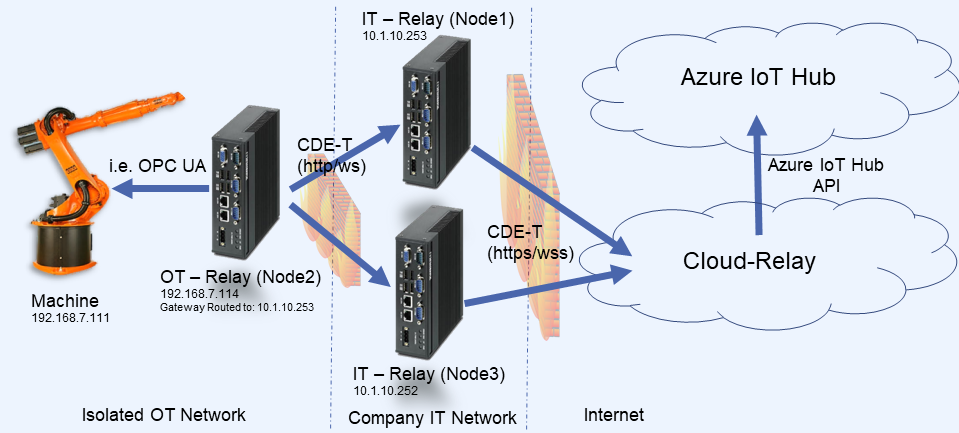

<!--
SPDX-FileCopyrightText: 2020 Connectivity-Labs
SPDX-License-Identifier: MPL-2.0
-->
# C-DEngine Technology Tutorial
This tutorial will walk you step by step through the development process of a C-DEngine bases solution.

## A complete sample Solution for the C-DEngine

This sample will show you how to create a small starter solution using several plugins. This sample will...
+ ... monitor and export some essential KPIs of the C-DEngine and your PC 
+ ... displays the results in the NMI User Interface
+ ... send messages on certain events 
+ ... show how to use Prometheus and Grafana to monitor KPIs externally

You can follow the tutorial step by step or start at any point using the source code on GitHub or the NuGet Plugins.

The Tutorial will go through the following steps:

1) Getting Visual Studio Ready
2) Creating a C-DEngine Host Application
3) Adding the NMI Plugin to the Host
4) Adding plugins from our Plugins Depot
5) Connecting the Host to the Cloud Relay
6) Diagnosing issues with Relays
7) Communication between Plugins
8) Scripting the C-DEngine
9) Adding a local node to your mesh
10) Pushing data into Azure IoT Hub
11) Securing the Host using SSL
12) Creating your own custom plugin
13) Advanced NMI Topics

During the tutorial we will make use of a variety of existing plugins.

>Plugins contain the "real meet" of a C-DEngine bases solution. Plugins are DLLs that host one or more services. Best practice is to have each service in its own plugin.

You only have to do very little coding during this tutorial. 
The plugins we are using are:

|Plugin Name | Description  | Type |
|--|--|--|
|CMyNetwork| A ping round-trip meter|Digital Twin/Device
|CDMyComputer| a health monitor for your hosting PC|Digital Twin/Device
|CDMyVThings| A variety of virtual things, algorithm and helpers |Pre-Processor/Service
|CDMyRulesEngine| A minimalistic rules engine to act on trigger |Pre-Processor/Service
|CDMyPrometheus| An exporter plugin for prometheus scrapers |Connector/Diagnostics
|CDMyVisitorLog| a plugin that can identify and count incoming connections |Pre-Processor/Service
|CDMyC3| An NMI Extension plugins for Charts|NMI Extension
|CDMyMessaging| Allows to send messages to users via email|Service
|CDMyThingProvisioner| This plugin is used to script the creation of things in order to build headless solutions|Service

## Chapter 1 - Getting Visual Studio Ready

We recommend using the latest version of Visual Studio. By the time of writing this article we were using Visual Studio 2019 16.0.
Make sure you have the following options installed when you install VS:
* ASP.NET and Web Development (.NET Core 3.1)
* .NET Desktop Development
* Universal Windows Platform Development (if you want to include the C-DEngine in a UWP application)
* .NET Core cross-platform development

We also recommend that you install the Visual Studio Project Templates for the C-DEngine. You can find the VSIX here: https://github.com/TRUMPF-IoT/cdeSDK/releases/download/5.105.0/CDEngineSDKTemplates.vsix

## Chapter 2 - Creating a host
The C-DEngine is a DLL that contains all the necessary services required to create an application but it does require a host to run in. The C-DEngine supports a variety of hosts like IIS, ASP.NET, Docker, Console or Windows Service. This Tutorial will use a .NET Core Console host.

1) To create the host, launch Visual Studio 2019 as Admin and create a new Project using the template "Console Host App for C-Labs C-DEngine (.NET Core)" in your favorite project folder


> We want to use the kernel http.sys as the WebServer for the host. Only admin has access to the http.sys. If you launch VS without admin, you can still create a host but the C-DEngine will revert back to a user-mode web server that has less performance.

2) Name the project "cdeHostNetCore"
After a short time you will see a small project with a program.cs and the C-DEngine icon.
3) Open the program.cs and make one change in line 36 by creating a new GUID with the GuidTool shipping with Visual Studio and pasting the GUID in the line.
4) run the project and look at the console output

If you see any error in the console, you most likely have a port conflict and something else already uses port 80. If so change line 39 and 43 to use any open port. Our recommendation is to use ports higher than 8700.

>If you are running VS as admin, you can use the same port for HTTP (MyStationPort) and WebSockets (MyStationWSPort). The http.sys can share the same port for http and websockets. If you are not running under admin, you have to specify a different port for the WebSockets.

The source of the host is fairly self explanatory but I want to point out a couple details:

#### DontVerifyTrust=true
The C-DEngine can ensure that only plugins are loaded that have the proper code signing certificate. Code signing requires a certificate and some extra build steps. For simplicity you can turn Code Signing off during development by setting "DontVerifyTrust=true". 
>If you are interested in Code Signing, please contact us at info@C-Labs.com of file an incident here and we will write more about it

### UseRandomDeviceID=true
For development it can help to always start the host fresh without storing any information on your Harddrive. This switch turns off all state management and gives the host a new DeviceID with every new start. If you keep this as the default (false) the DeviceID and other state information are saved in a folder under your bin file: "ClientBin/cache". You can delete this folder to start fresh with the host again.

For easier access to configuration settings you can add a "App.Config" file to your host project and add all these settings there:

```XML
<?xml version="1.0" encoding="utf-8" ?>
<configuration>
  <appSettings>
    <add key="UseRandomDeviceID" value="true"/>
    <add key="DontVerifyTrust" value="true"/>
  </appSettings>
</configuration>
```

### ...meanwhile...
While the host is running, you can enter "b" in the console and a Brower will open with the User Interface of the node. As we have no NMI Runtime installed, yet, the browser will only show:

**Resource http://yourpc:yourport/lnmi not found***

Right now the C-DEngine is running in headless mode. We will add the NMI in the next step.

## Chapter 3 - Adding the NMI Plugin to the Host
Adding the NMI Runtime to the project is as easy as adding a NuGet:

1) Open the Nuget Manager and browser for "NMI"

You will find the CDMyNMIHtml5RT package - just add it to the project. You don't have to do anything to your program.cs - just run it again

If you now enter "b" in the console the browser is showing a login screen.
By default the program.cs creates a random Scope for the host (in line 98).
You can create a different Scope for easier development as the Scope will change every time you restart the host.

You will find the Scope ID in the console in the second line of the output:

```Scope ID: XXXXXXXX```

> This "Easy Scope ID" is a Base32 string with up to 8 characters and will be converted into a secure hash token once "SetScopeIDFromEasyID" was called. The C-DEngine will not store the EasyScopeID anywhere and only works with the internal hash of the token. 

2) Enter the Scope ID in the Login dialog and click on "Set Security ID"

You will now see the minimalist NMI (Natural Machine Interface) of the Host. 

3) Select NMI Admin and you can see a variety of options.

To stop the host, simple press ESC in the console. If you have the browser open you will see that you get immediately logged out of the NMI when the host stops.

>This happens because the browser is creating a WebSocket connection to the C-DEngine base Host. Once the host stops, the WebSocket connection is terminated and the user is disconnected.

## Chapter 4 - Adding plugins from our Plugins Depot
The cdePlugins depot on GitHub has several plugins we can now add to the project. We are working on publishing more and more plugins as NuGets over time. You can browse for compatible plugins by searching for "CDMy" or "C-DMy" in the NuGet Package Manager.

>C-DEngine requires and automatically recognizes plugins by the prefix "CDMy" or "C-DMy". Therefore its very simple to add new plugins to NuGet and the bin folder

First add the C-DMyNetwork plugin.

If you want to use the source...
1) Clone the "cdePlugins" depot to your local drive
2) Add the project "src/093 - C-DMyNetwork"
3) Add a reference to this new project to your Host Project
4) Run the solution (Make sure your starting project is the Host)

If you now login to your NMI, you will see the NMI for the Network Plugin.
Lets create a "Digital Twin/Thing" in the network plugin.

>In the C-DEngine a "Digital Twin" is a "Thing" managed by the C-DEngine. From now on we will call this a **"Digital Thing" or D-Thing**, A D-Thing (of the base class "TheBaseThing") is owned by a plugin and represents the state of a physical device. Things are managed and stored in **TheThingRegistry**.

In case of the network plugins, we are creating D-Things of ping-able network end points such as the DNS Server of Google (at 8.8.8.8).

>***Important Note***: If you still have "UseRandomDeviceID=true" set, your new digital twin will be gone after you restart your host. We do recommend that you change this to "false" now for the remainder of the tutorial.

1) To add add a digital (endpoint) D-Thing click on the "Devices/Network Status" tile in the NMI
2) Then click on "Add new Network Service"

> A wizard will appear. Wizards are part of the plugin and help to create new instances of digital twins


3) In the wizard set the following values:

|Button  |Action  |
|--|--|
|Name Your Service| Google DNS |
|Service Type| Ping Service|
|Address| 8.8.8.8 |

Once you click finish, you see a new tile in the NMI for the Google DNS
If you click on it, you see the device status:


You can see the "Value" updating frequently. Its shows the roundtrip time of a ping from your host PC to the Google DNS.
If you open up the "Connectivity" Group by clicking it, you can see that "Auto Connect" and "Is Connected" are selected. you can also see and change the address of the ping as well as change Ping parameter if you open that group.

### TheThingRegistry - Central Digital-Thing Database

Lets have a look where this D-Thing was created.

1) Click on the C-DEngine logo in the top left and then the little home icon.
This brings you back to the main portal
2) Now click on the NMI Admin and then "Thing Registry" tile
3) in the top right corner of the table click the little "Refresh" icon and you will see all "Things" your host is currently managing.

In the "Friendly Name" column you will find your "Google DNS" thing.

You can also see the "DeviceType" is stating "Ping Service". You will find two other DeviceTypes that the system has created:

+ ***ApplicationHost***:  The Digital Twin of your Local Host application. Contains only basic information about your host but you can dynamically add your own properties to it. The C-DEngine will persist these properties for you
+ ***IBaseEngine***: For each Service in plugins the C-DEngine will create a Digital Twin with the DeviceType "IBaseEngine". Here all properties that are related to this service are stored. 

To the left are three buttons:

|Button  |Action  |
|--|--|
|| Jump to the Thing's NMI. This "Details" Button is used in many placed to **open up more details on some-thing**  |
|| This button allows you to download the JSON description of the Thing |
||  This button gives you some more options to analyse your Thing. Especially interesting is the "All Properties..." Group. If you open it, you will find all properties a Thing has. |

Things in the C-DEngine only consists of Properties! All of which are stored in the ThingRegistry (class name: TheThingRegistry). Developer can access things via TheThingRegistry APIs.

>In the C-DEngine "Digital Things" only consist of Properties!. Properties can be created dynamically at runtime and are stored in TheThingRegistry. This very simple concept is also very powerful as it can be extended at anytime. You can listen to PropertyChange events and trigger actions by these changes. The NMI is the graphical representation of these properties and offers a wide variety of controls a developer can use to design the UX.

If you click on the "More Options" of your thing, you can see a lot more interesting things you can do with your D-Thing. 
We will us the "Export Pipeline" later in Chapter 8 for scripting the creation of D-Things.

## Chapter 5 - Connecting the Host to the Cloud Relay

Solutions with the C-DEngine can run completely on premises without the need for an internet connection. But if an internet connection is available, the host running the C-DEngine can easily be connected to a "Cloud Relay" allowing access to the local NMI via cloud connected devices.  
This is as simple as adding one line of code to our hosts program.cs:

1) in the program.cs add the following line after line 54:

```
ServiceRoute="wss://cloud.c-labs.com"
```

Now start your host project again. If you login to the local NMI you will now see a couple more tiles under the category "Diagnostics" and a new category "Node: C-Labs Cloud" is showing.

You can also login to the Cloud with you ScopeID by going to 
```
https://Cloud.C-Labs.com/nmi
```
You will see the same login dialog as you had locally. 
After you enter your Scope ID you will see the same NMI as on the local node.

Click on the "Network Status" tile and you should see your "Google DNS" tile that you have seen in the localhost browser. But when you click on it, you will see a slightly different presentation:


The NMI for this "Digital Thing" only allows viewing of certain controls via the cloud. The developer of the D-Thing (plugin) can determine what controls should be visible on Local Nodes vs Cloud Nodes. These settings can also change by User Access Level Permission. 

>For Development purposes the User Manager is not enabled by default. Also the ***Cloud.C-Labs.com Cloud Relay does not support the user manager and is for testing purposes only!***

### What does the Cloud-Relay do?
By now you might be wondering why you did not have to sign up for any service, subscription or other registration for the Cloud access to work.

A C-DEngine based Cloud-Relay is a highly-tuned, multi-tenant "Access Point" for authorized hosts. As the names suggests it only "relays" data between two or more (C-DEngine) hosts. The browser you are using is a special kind of Host running the JavaScript version of the C-DEngine. 

### Scoping is the Key!

Your local host is connecting to the Cloud-Relay with the scope you generated in program.cs. Any browser must use the exact same scope to connect to the same "Mesh" of nodes. The Cloud-Relay is then working as a relay for the data flowing between the local host and the browser.

>The NMI is model based and consists of meta data the browser knows how to render in HTML5. In the future there might be other renderers that can display the NMI in XAML. Unity or other front ends.

You can connect as many browsers and local hosts (also called "nodes") to the same mesh (of nodes). As long as all of them use the same Scope ID, they can all see each other. Browsers will see the NMI of all connected nodes in the same portal. Even if you connect your browser to one of the local nodes, you will always see the NMI of all mesh connected nodes.

>A PC can run multiple nodes at the same time. A "node" is a more abstract term for a host. Theoretically a host can contain multiple nodes when the host connects to multiple other nodes using different scopes. But lets not get ahead of ourselves.

Look at our concept documents on GitHub [https://github.com/TRUMPF-IoT/cdeDocs/tree/master/docs](https://github.com/TRUMPF-IoT/cdeDocs/tree/master/docs) for more details

If you change turn on the "UserMapper" your node will prompt you for a UserName and Password. These credentials are then "Mapped" to the ScopeID of the Node. Once you switch to the UserMapper, you cannot switch back to "Scope Login" as that would present a security risk. Also you cannot use the UserMapper with the Cloud.C-Labs.com as the UserMapper is not turned on for this test cloud. 

>If you are interested in hosting your own cloud-relay please contact [info@C-Labs.com](mailto:info@C-Labs.com).
 
## Chapter 6 - Diagnosing issues with Hosts, Nodes and Relays

The more complex a system gets the more important it becomes to diagnose issues. C-DEngine bases hosts offer several ways of diagnostics:

### The cdeStatus.aspx page

Any running node containing the C-DEngine and is setup as a web server provides the cdeStatus.aspx page. For example if you set your MyStationPort to 8800 the cdeStatus page is found at:

```
http://localhost:8800/cdestatus.aspx
```
This page has multiple sections that are important for diagnostics:

#### "NodeInfo"

This section shows a summary of basic information of the node the status page is called from. The section is fairly self explanatory.

One notable entry here is the "Local Node-Scope". It shows only the first 4 digits of a much larger scope-token that is used to establish encrypted communication with other node.

> The C-DEngine allows to create a custom Crypto DLL that can be used to change the way the C-DEngine manages and creates tokens and keys. The Crypto DLL must match on all nodes in a mesh for communication to be possible.


#### "Status of Engines"
This table shows a list of all currently running "Engines". 
>An Engine (aka "Service") is a container service managing one or more "Things". Plugins can have one or more Engines/Services. Most plugins have only one service for better management. 

You can see the version of a service and the "LastMessage" of the service.
In your plugin code you can set this message using:
```
            MyBaseEngine.LastMessage = "Some message here";
```
#### "Nodes with SenderType=XXX"
The next tables show connected nodes - either out bound or inbound depending on the SenderType. There are 10 different SenderTypes the C-DEngine manages - each one having a different purpose:

* ***LocalHost:*** This is the node you are currently on/showing the cdeStatus of. 
* ***CloudRoutes:*** If the node is connected to one or more Cloud-Relays you will + find the information about this connection here.
* ***BackChannels:*** If other nodes are connected to your local host, each of these nodes will show up in this list. A "BackChannel" is therefore an inbound connection to the local node
* ***Phone/Device:*** Devices are hosts/nodes that can only connect outbound and do not have their own webserver. This is very useful for devices like phones that cannot or do not accept inbound connections.
* ***JavaJson:*** Browsers are showing up as JavaJson. Browsers are in many cases handled differently than other nodes as they are declared "unsecure". Since they cannot decrypt any of the incoming telegrams, the node a Browser is connected to is the browsers "Security Proxy" and must decide if a telegram should be forwarded to the browser or not. Its also up to this "First Node" to enforce the http browser security attributes such as HTTPS/TLS and session token based RSA encryption.
* ***Service:*** A service is similar to a CloudRoute but locally on Premise. The main difference between a Service and a CloudRoute is that a Service can create a bi-directional http-push setup. Meaning if two nodes are connected as services, both sides can connect to the others "WebServer" and push http messages. 

Nodes are either "Active", "Passive" or "Relays". 

> "Active" nodes have no web-Server and "actively" connect to another node that is either Passive or a Relay. An example of an Active Node is a "Device" or a "Phone"

> "Passive" Nodes cannot actively connect to other nodes and wait for other nodes to connect to them. A Cloud Relay is a passive node as a cloud relay will never actively connect to another node

> "Relay" nodes can do both - connect to other nodes and have other nodes connect to them. The local host you created during this tutorial is one of the "Relay nodes" as it can connect actively to a Cloud Relay and other nodes can connect to it. In Step 9 we show how to local nodes can talk to each other creating a bigger mesh.

The cdeStatus.aspx page has several other options you can explore:

### cdeStatus.aspx?SUBSUM

This option will adds three more sections around subscriptions on the cdeStatus page:

#### Current Subscribers by Topic
Shows all Services and their subscribers segmented by Scope Hash.

A Scope Hash is a 4 digit hash of the Scope ID used for the mesh. For security reason only a 4-digit hash is used and not the full ScopeID.

> The C-DEngine uses the basic principles of Pub/Sub for its communication. With one major twist: All Nodes are Publisher AND subscriber at the same time. This allows forwarding of messages along a series of nodes, if all nodes have the same subscription topics. There is one subscription that all nodes always have: "ContentService". It can be used to send messages across the complete mesh to all nodes. More later when we discuss the messaging APIs in detail.

Use this to see if your nodes have all the correct subscriptions. Data between nodes is only flowing if all nodes have the same subscription and the same Scope.

#### Current Scopes and its Subscribers
This is basically the reverse lookup to the previous section. It shows all Scopes and the corresponding subscribers.

Use this to find out if all expected nodes in a mesh are indeed connected to the same mesh.

#### All known Nodes: XX
This section shows all known nodes current connected to the local host (XX tells you how many nodes are connected).

Each Node connected also shows the services running on the node, their scope (hash) and in brackets the telegrams sent by the service per minute and since start of the node.
A node is showing in red, if the node has no valid code-signing certificate. 
The very last entry per node in the table either shows a thumbprint of the Client Certificate the node is using. If the connection was established without client certificate its reads "No cert".

> The C-DEngine takes security very serious. By adding Code Signing Certificates to the plugins and host you can be ensured that only signed and therefore no tampered plugins participate in a mesh. 

>The WebServer of each node can be set to require a client certificate and only nodes with the correct client certificate can then connect to this server

Use this section to looks at all connected nodes and learn about what Services they consist of. The CMyVisitorLog plugin is able to identify connecting nodes by their "Footprint of Services" for accurate reporting.

#### cdeStatus.aspx?SYSLOG
A very important diagnostics tool is the System Log (SYSLOG). It prints all internal messages that help developers and system administrator to identify issues.

The amount of verbose output is determined by the "DebugLevel". 
> you can find the DebugLevel in line 54 of the program.cs. The higher the level the more output the System Log will generate. ***BEWARE: more output also means more load on the system caused by the log. We do not recommend any setting over 1 (Essential) for production systems!***

If you are running your local host from the command line, you will see all the System Log entries in the console as well.

Like all other tables on the cdeStatus page, you can export the content to a CSV file for external analyses. Also almost all tables in these sections can be sorted by clicking on one of the headers.

#### Securing the cdeStatus.aspx page

For production system you might not want to expose the cdeStatus page to any user. 

In order to Secure the page you can add the following line to your program.cs (after line 82):
```
ArgList["StatusToken"] = "mysecret";
```
If you now want to see the cdeStatus.aspx page you have to add the token in the query path:
```
http://localhost:8800/cdeStatus.aspx?mysecret
```
You can put this in your App.Config or even write a plugin or extend your host to change this token with any algorithm you like.

During runtime you can access any of the Setting by calling the Settings API. To Set a new token at Runtime call:

```
TheBaseAssets.MySettings?.SetSetting("StatusToken", "newsecret");
```
To learn more about all the settings for the C-DEngine visit this page:
[https://github.com/TRUMPF-IoT/cdeDocs/blob/master/docs/Concepts/C-DEngineSettings.md](https://github.com/TRUMPF-IoT/cdeDocs/blob/master/docs/Concepts/C-DEngineSettings.md)

### C-DEngine KPIs
The C-DEngine has many KPIs that can be used to measure its performance over time. 
By defaul these KPIs are turned off. In order to enable the KPIs add this to your configuration settings:

```
ArgList["EnableKPIs"] = "True";
```
KPIs are collected in the Properties of the "ApplicationHost" thing. (see previous chapters). Once you turn on the KPIs and you go back to the ThingRegistry you can see a snapshot of the current KPIs.

Lets display one of these KPIs in the NMI. In order to do so we need the CDMyVThings plugin. 

1) Add the CDMyV-Things plugin to your project (either using NuGet or include the source of the "cdePlugins/src/066/C-DMyVThings" to your project)

> Do not forget to add a reference to the plugin project to your host if you use the sources

2) Log back into the NMI and you will see a new tile "Virtual Things" in your portal.
3) Click on the tile then inside the Virtual Things Dashboard, click on "V-Things List"
4) in the list click the "Add V-Thing" button on the top left of the table
5) The table will add a new row and ask you to enter a "friendly name" and "Device Type" for the new V-Thing. Enter:

|Column  | Selection |
|--|--|
| Friendly Name | My KPI |
| Device Type | Virtual Sensor|

Then select the check to create the new thing.

> Most plugin dashboard follow the same user interface process: click on Main Tile in the Main Portal leads to the Plugin Dashboard, there you find a "...List" tile which contains a table with all existing thing instances this plugin is managing. There are exceptions to this rule: for example plugins that can scan for their hardware twins automatically and do not need user input to create instances.

7) Click on the button in the first column and you will see a empty sensor dashboard
8) Click on the Blue "Sensor Report" line to open the configuration dialog of the Virtual Sensor


9) In the "Thing Picker" select "Application Host: My-Relay"
This is the "ApplicationHost" Digital twin of your local host
10) In the "Property Picker" select any KPI you want to look at. For example "QKBSent"

Immediately after you selected the property, the sensor template will show values in the charts and gauges. 
> If you do not see the charts, you probably are running the local host without a connection to Cloud.C-labs.com. The charts requires a plugin called "CDMyC3". A plugin you can find in the cdeNMI/src/HMTL5/NMIExtensions depot. If you do not have it installed the charts will not show. But if you are connected to the cloud, the plugins javascript components are fetched from the Cloud Relay and for the browser it looks like all came from the local node. As mentioned before, the nodes are all "Meshing" their information and meta data making distributed development a blast!

11) Click on the Line "Sensor Info...". This open a section that allows you to describe your sensor in even more details. The details will be shown in the "Device Description" section of the Virtual Sensor Dashboard

12) Click on "Sensor Settings..." and you can set several important settings of the Virtual Sensor.
For example if you change the "Max Value" to 2000 you see the gauge immediately changing its Range. You should also adjust the "Bucket Steps" to a higher number such as "200" for the "Distribution Curve" to make sense.

If you open the "Value Trend" you will find a long term historian of the KPI.

> This will only work if you have the CDMyC3 plugin installed on your local node because the rendition of the charts data require transformation by the Plugin on the plugin that collects the data. This is required for performance reasons otherwise all the raw data will be sent to the cloud, transformed and then sent back to the browser. In the future the C3 plugin might add even remote transformation as an option

The live chart is not updating is "Max Value" automatically. In order for it to update you have to refresh the page. ***Do NOT use the browser refresh as this will tear down your current secure browser session!***. Instead use the little refresh button on the top left of your "Sensor Report". If you had any configuration sections open (in so called "Collapsible Groups") they will be all closed after the Dashboard refresh.

Can you create another Virtual Sensor for the "Google DNS" digital twin we created earlier?

Here the quick cheat-sheet:
1) Go back to the "V-Things List" and "add a new V-Thing"
2) Select "Virtual Sensor" as device Type and give it a friendly name
3) Open the Sensor Report and "Thing Pick" the "Google DNS"

Since "Value" is the default property, you will immediately see the values coming in.

#### See Mommy- no hands...

Go and login to the cloud.c-labs.com/nmi to see the same dashboards you just created in the cloud! 

Go and play a little with the V-Things plugin. There is a documentation on the V-Things plugins here: [https://github.com/TRUMPF-IoT/cdeDocs/blob/master/docs/plugins/066-VThing.md](https://github.com/TRUMPF-IoT/cdeDocs/blob/master/docs/plugins/066-VThing.md)

If you have loaded the CDMyVThings plugin as source you will find references to the "cdeSensorTemplate" NuGet from the cdeSDK depot. This shared project just contains the APIs to create the Sensor Template used by the "Virtual Sensor". You can include that NuGet in your project and add the Sensor Dashboard to any of your plugins. We will do this later in the "Custom Plugin" chapter.

### Export of KPIs to Prometheus

One of the most important diagnostics options is to output all the KPIs of the C-DEngine via the CDMyPrometheus plugin that the KPIs can be consumed by a Prometheus scraper and visualized in Grafana.

You can do this very easy by adding the CDMyPrometheus plugin to the project either via NuGet or adding the "cdePlugins/src/188 - CDMyPrometheusExporter" source.

1) Log back into the NMI and navigate to the Prometheus Plugin Dashboard

You will see that there is already one Prometheus plugin running - this is our KPI exported on the Test Cloud.C-Labs.com.

2) Click on the "Prometheus Exporters" tile and then on "Add a Sender".
3) Enter these settings:

|Column  | Selection |
|--|--|
| Friendly Name | My Prometheus Endpoint |
| Device Type | Prometheus Exported|
| Address | mymetrics |

If you leave the "Address" empty  the plugin will automatically assign "metrics" as the address. This is the default endpoint for Prometheus but for security reason we do not recommend the default as hackers do know this default as well. Rather give it a specific name for your host.

4) click on the details button to configure the Prometheus endpoint. 
5) In the device Status Group click on "Sender Thing List" and then "New Thing"
6) in the "Thing to Export" select "My Relay" and add some "Properties to send" (i.e KPI1, QKBSent, QSQueued)
7) By defaul the thing is disabled, uncheck "Disabled" and you are done
8) Go back and open the "Connectivity" group then click the "Connect" button and if you like enable "Auto Connect". This will start the Prometheus end point when the relay restarts.

You can now test the endpoint by navigating with your browser to

```
http://localhost:8700/mymetrics
```
You will see the Prometheus formatted output.

If you now install Prometheus and point at this endpoint you have a valid Prometheus data Source that you can use in Grafana or other Prometheus compatible logging application.

## Chapter 7 - Communication between Plugins

Plugins can talk with each other either through messages or by listening to property-change-events of D-Things managed by other plugins.

A great example how plugins do work with each other is the use of the Virtual Sensor in the V-Things Plugin and the Network Status plugin.

Another example is the use of the Rules Engine. It can combine three plugins in one workflow. For example: 
+ A trigger from the Network Status plugin (If a ping takes more than 1 second)
+ An Action in the Messaging Plugin to send an alert email to a user
+ Using the Rules Engine to define the trigger and the action

The Messaging plugin has some interesting development features that you can check out in [the source code of the Messaging plugin found here](https://github.com/TRUMPF-IoT/cdePlugins/tree/master/src/093%20-%20CDMyMessaging)

1) install the CDMyRulesEngine and C-DMyMessaging plugin (either via NuGet or cloning the cdePlugins Depot for the source)
2) run your project again and login to the NMI 

You will now see two new plugins in your dashbard. Lets first configure the Messaging Plugin

3) Click on "Messaging" then "Messaging Targets" then "Add a new Messaging Target"
4) In the new row enter:

|Column  | Selection |
|--|--|
| Target Name | My Email |
| Device Type | Email Message|
| Recipient | yourEmail |

5) then click return and then click the details button as you should be very familiar with by now.
6) you now need to create a message template and point at a server. 
7) we want to send a message if the ping latency was too high. You can enter "Ping too High" in the subject and a more detailed message in the "Message". You do not need to put anything here as this text will come from the rules engine. But if you want to test your email it might make sense to put "Test email - please disregard" in here.
8) Open the "Additional Settings" and enter the information for your SMTP server.
9) Click on the "Send Email" button to test your configuration

#### Now lets configure the Rules Engine

The rules engine comes with a wizard:

**Step 1:** Give your rule a name like "Ping too high send message"
**Step 2:** Trigger - Set these values:

|Column|Selection|
|--|--|
| Trigger Thing | Google DNS |
| Trigger Property | Value|
| Trigger Condition | Larger |
| Trigger Value | 1000|

This creates a trigger on the "Value" property of the "Google DNS" thing if its value is larger than 500.

**Step 3:** What action to do: "Set Property on Thing"

**Step 4:** Select "My Email" as the "Action Thing" and "sendmail" as the action property.

**Step 5:** As "Action Value" use "The ping was higher (%Value%) then expected (%TriggerValue%)". 

This will be sent to your email instead of the body of your email template.

In the final step you can set if you want to activate the rule right away and if the rule should be logged whenever it triggers.

Back in the dashboard you will see your new rule. Click on it to examine what the wizard has created for you. In the "Current Value" you can see the actual value of the Ping and if its greater than 500 the rule will fire

>If you want to test the rule, just click on "Trigger now".

You can also send a message to any "Engine/Service" with the rules engine. Just open the "TSM Action" group, select a TSM Engine (this are known services on the local node), set a TSM Text and a Payload.
Marcos for properties of the Trigger Object work for both Text and Payload.

## Chapter 8 - Scripting the C-DEngine

The C-DEngine allows to script the creation of Things for headless (without NMI) configuration of your nodes.
There are two ways of scripting:

* Using .cdeConfig files - this is using the C-DEngine Sensor Pipeline. A detailed description of [this pipeline can be found here](https://github.com/TRUMPF-IoT/cdeDocs/blob/master/docs/Concepts/SensorPipelineModel.md) 
* Using .cdeScript files - this is using TheThingProvisioning Plugin to send messages to Things at startup

Lets use the cdeConfig File to automatically create the CDMyNetwork "Google DNS" D-Thing:

1) Go to TheThingRegistry and go to the details of your "Google DNS" D-Thing
2) Click on the blue Details button 

Now click on the "Export Pipeline Generalized" button.

Your browser will now download a .cdeConfig file with this content:

```JSON
{
  "FriendlyName": "Google DNS",
  "ThingConfigurations": [
    {
      "ThingIdentity": {
        "EngineName": "CDMyNetwork.MyNetworkServices",
        "DeviceType": "Ping Service",
        "ID": "327c7a23-54b7-4e29-bd95-fff6fc47ae2a"
      },
      "ConfigurationValues": [
        {
          "Name": "AutoConnect",
          "cdeT": 2,
          "Value": true,
          "Generalize": false,
          "IsThingReference": false,
          "Required": false,
          "Secure": false
        },
        {
          "Name": "PingDelay",
          "cdeT": 1,
          "Value": 3000,
          "Generalize": false,
          "IsThingReference": false,
          "Required": false,
          "Secure": false
        },
        {
          "Name": "Address",
          "cdeT": 0,
          "Value": "8.8.8.8",
          "Generalize": false,
          "IsThingReference": false,
          "Required": false,
          "Secure": false
        },
        {
          "Name": "PingTimeOut",
          "cdeT": 1,
          "Value": 3000,
          "Generalize": false,
          "IsThingReference": false,
          "Required": false,
          "Secure": false
        },
        {
          "Name": "FailureLimit",
          "cdeT": 1,
          "Value": 1,
          "Generalize": false,
          "IsThingReference": false,
          "Required": false,
          "Secure": false
        },
        {
          "Name": "FriendlyName",
          "cdeT": 0,
          "Generalize": true
        },
        {
          "Name": "ID",
          "cdeT": 0,
          "Generalize": true
        }
      ],
      "ThingSpecializationParameters": {
        "FriendlyName": "Google DNS",
        "ID": "327c7a23-54b7-4e29-bd95-fff6fc47ae2a"
      }
    }
  ]
}
```

3) Change the Friendly Name to "Google DNS2" and give the "ID" a different GUID. ***ASK MARKUS: Why is the ID twice here - can you explain?***
4) Now copy this file in the ClientBin/Config folder. If this folder does not exist, just create it.

> If you want to delete a D-Thing, you can either do this in the Plugin Dashboard and "List of Things" table, or directly in The Thing Registry

5) Start your project again and you will see during the startup a new "Google DNS2" D-Thing was created.

Using "Answer" files you can set specialized Parameters for each cdeConfig file ***MARKUS: Can you show how this works with some easy steps?***

### For Developers...

In order for the Configuration Pipeline to work, you have to annotate your D-Thing class. How this can be done will be explained in the Chapters 12 and later.

## Chapter 9 - Adding a local node to your mesh

We are now going to walk through a couple advanced scenarios.

> Multiple Nodes/Hosts that are connected to each other are forming a "Mesh". There are many different topologies for meshes as you can see in this illustration:


In order to show how a mesh works, lets create a mini mesh.

1) Create a new Project in Visual Studio - either in the same solution as before or start Visual Studio again and create a new project in this new instance.
2) Choose the same project type "Console Host for C-DEngine (,NET Core)" as before an call your project "cdeMiniNode"
3) In the program.cs make these changes:

+ Line 36: Create a new guid or use the same one as before. This guid will only be used by Provisioning Tools once you go into mass production and deployment. 
+ Line 39 and 43: Change these ports to a free port (i.e. 8704)

4) Add this new line after Line 54:
```
ServiceRoute = "ws://localhost:8700"
```
The Port 8700 must match the port you chose in Chapter 2 above for your first node.  "WS" stands for WebSockets but you can also use HTTP if you prefer.
In the next chapter we show how to secure a node using TLS/SSL. This allows you to use "WSS" (WebSocketsSecure) or HTTPS.

4) You now have to use the same ScopeID on both nodes in order for them to connect. replace line 98 in both projects with:
```
strScope="12345678";
```

> ***WARNING***: Do not use hard coded Scopes in your application. A better way is always to either let the user enter the ScopeID or store the scope ID in some secure store. You could also generate the ScopeID from the MAC address of the PC if your run both nodes on the same PC.

Also change "UseRandomDeviceID=false" to persist our changes, and add "EnableKPIs=true" as you did before 

4) run both the old and new project

If you have a DebugLevel higher than "OFF" selected, you will see on both nodes a "connecting" message. 

> Lets call the node created in the original project "Node1" and the mini-Node "Node2".

5) Open the Status.aspx page of Node1

You can see in the list of "Nodes with SenderType=BackChannel" a new entry for Node2.

If you login to your NMI (on Node1) you can see a new Tile with "Overall Node Status" for Node2 but other than this nothing else...the new node is not running any plugins yet.

6) Go ahead and install the V-Things plugin into the project of Node2 and log back into the NMI on Node1. Then click on the V-Things Tile in the main Portal

You will now see two "Status" icons but you cannot create new V-Things for Node2. The reason is that the security of the C-DEngine recognizes that you use the NMI of Node1. This makes you administrator on Node1 but only "Guest" on Node2. A guest cannot create new instances of things (well, at least not for the V-Things plugin. Its up to the developer of the plugin to make this decision).

If you try to login to the NMI on Node2 you will see the error message we got already in chapter 2. The NMI Plugin is not installed on Node2 making it a "headless" node. 

7) Install the NMI Runtime Plugin on Node2 and restart Node2 (Node1 can continue to run)
8) Now login to the NMI of Node2 and click on the Virtual Things Tile in the dashboard. You will see the exact same screen as before with a tiny difference: The "V-Things List" is now under the category for Node2! 
9) Click on the V-Things List and create a new Virtual Sensor for any KPI you want.
10) now navigate back to the Virtual Sensor Dashboard and you will see all three sensors: two from Node1 and one from Node2.

You can now login to Node1 or Node2 or even the Cloud.C-Labs.com/NMI and you will always see all three sensors!

Check out the "Network Status" dashboard from earlier in the tutorial. If you login via Node2 you see the same reduced dashboard of your "Google DNS" Twin as you saw on the cloud-relay, but you do get all the essential information like the round-trip-time.

### What is this good for?

What we have created is a so call "Forwarder Mesh". 


Imaging Node2 being on the OT Shopfloor with no access to the internet but you want to monitor data from that Machine in the cloud. 
Node1 is in the DMZ or on the IT side of your company. Node2 sends its information to Node1 and Node1 "forwards" that information to the Cloud.

You can have any number of forwarder nodes to overcome any network topology a customer might have!
You can also use redundant paths by adding a second Node to the IT (DMZ) and have Node2 point at two nodes simply by separating the ServiceRoutes with a semi-colon:
```
ServiceRoute = "ws://localhost:8700; ws://anotherip:anotherport;..."
```

Showing a redundant path in the IT Relay and a custom Azure IoT Hub Plugin in the Cloud-Relay.


You can also have multiple nodes on the OT floor connecting to Node2 and have it send Information (called "forwarding" or "relaying") on to the next node.

As you can see you can create very complex mesh setups using C-DEngine nodes. 

With this in mind you can setup any combination of nodes you can imaging - or better - fitting the needs of your customer topology.

> As a rule of thumb always connect from a lower security network into a higher security network. NEVER the other way around! And IT devices/virtual machines/PCs/Servers are much more secure than OT machines or devices.

To bring this scenario even further, you can now create another node in a completely different region of the world and connect to the Cloud-Relay. As long as they share the same ScopeID, data will flow to that node as well.

## Chapter 10 - Pushing data into Azure IoT Hub

A core scenario of the C-DEngine is the on-premise datacollection for Cloud Services such as the Azure IoT Hub. 

***PLUGIN Azure IoT Hub***

Elaborate!!

## Chapter 11 - Securing the Host using SSL

Depending on the host framework you are using (ASP.NET, IIS, Windows Service or Command Line) the procedure for securing your host is different. 
Since the C-DEngine is based on standard HTTP/WebSockets code, adding SSL/TLS to your host is more administrative work than coding. In fact you do not have to write a single line of code to enable SSL/TLS.

You can require only secure connections to a host by setting the MyStationPort and MyStationWSPort to 443. This will automatically require the connecting node to use HTTPS or WSS. 

>The internal C-DEngine WebServer will only accept HTTP/WSS requests on Port 443. If you need/want to use a different port for incoming secure connections, you have to host the C-DEngine node inside IIS or ASP.NET.

To learn more about how to setup your hosting PC check out this document: [https://github.com/TRUMPF-IoT/cdeDocs/blob/master/docs/Concepts/C-DEngineSecureOn-premiseRelays.pdf](https://github.com/TRUMPF-IoT/cdeDocs/blob/master/docs/Concepts/C-DEngineSecureOn-premiseRelays.pdf)

There are many other security related configuration settings at the disposal of the Node Administrator and Developer.

### Client Sided Certificates

The ultimate protection for connections is using Client Side Certificates. The C-DEngine fully supports this secure way of connecting nodes.

Client side Certificates are enforced on nodes other nodes connect to. For example the Cloud-Relay or in our example above "Node1". 

A developer of a node or an admin of a mesh system can specify how strict the usage of Client Certificates should be by setting the "ClientCertificateUsage" setting:

-   If set to 0 or does not exist, a client certificate is not used and not required (default mode of previous CDE versions)
-   If Set to 1, client can present a client certificate. If no scopes are in the cert, scopes will be used as before (Mix operation between certificate based and "EasyScopeID" security mode)
-   If Set to 2, client must present a valid client certificate. If no scopes are in the cert, scopes will be used as with "1" 
-   If set to 3, all clients (including NMI browsers) need to present a client certificate (Nodes with just EasyScopeIDs will not able to connect)
-   If the client certificate contains one or more SAN URLs of the scheme "com.c-labs.cdescope://" the client will only participate in scopes with that scopeID. The first cdescope is used as the ScopeID if no scope is presented in the message or connection
-   In IIS, settings 2 and 3 require the "Client Certificates" setting in "SSL Settings" to be set as "Accept" or "Require" for NMI access

> Client Side Certificates require a stable and scaling certificate management system. 
If you are interested in a certificate management solution for your system, please contact us at info@C-Labs.com

## Chapter 12 - Creating your own custom Plugin

Until now you were using the C-DEngine and plugins with writing almost no lines of code. 

One of the best features of C-DEngine solutions is that you can easily extend its functionality - even at runtime! 

In this chapter we go through the essential steps to create your own custom plugin...and you will finally write some code!


<!--stackedit_data:
eyJoaXN0b3J5IjpbLTI0Njc2NTM5NywtMjA3NDMxODc1MSwxOD
k5MDk0NDYxLDEzNTYxODEzNzUsMjA2NDg0NDg4NCwtOTAxMjA5
OTg5LDU4ODkwNzk5NywxNTI5MDMwNTQyLC0xMjE3ODMzMjAzLD
M4NDQ2NTgwNiwtOTEyMDcxNzQ1LDgxMjAzMTc3MSwtNjg0MTk1
OTUzLC04Njc3Njg3MzcsMTE4MDA1NjUyNiwtMTg0MDMzMDczOC
wxMTE2OTk1MTQwLDExMzMxOTUyOTQsMTU4ODI2MzY3MywtNzcx
ODc2MDMzXX0=
-->