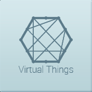
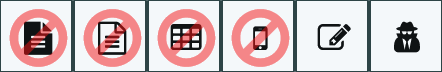

# V-Things Plug-In - Quickstart

Welcome!
========

The C-MyThings Plug-In, is a collection of
functions and other useful virtual-things for the C-DEngine

Graphics and styles might be different from the final plugin.

Contents 
========

+ [Welcome!](#welcome)
+ [Overview](#overview)
+ [Requirements](#requirements)
+ [Installation](#installation)
+ [Configuration](#configuration)
+ [Basic Operation](#basic-operation)
+ [Countdowns](#countdowns)
+ [Timer](#timer)
+ [Memory Tag](#memory-tag)
+ [NMI Control](#nmi-control)
+ [NMI Element](#nmi-element)
+ [Data Generator](#data-generator)
+ [Data Verifier](#data-verifier)
+ [Advanced Topics](#advanced-topics)
+ [Flags](#flags)
+ [All Properties](#all-properties)

Requirements
============

The V-Things Plug-In requires an IoT relay host based on the C‑DEngine

Configuration
=============

The Configuration of the V-Things Plug-In can be found in the NMI main
Dashboard by pressing this button:

New V-Things can be added in the "V-Things List"

To add a new V-Thing, click on "Add new V-Thing".

Under type select the V-Thing you want to add then give it a friendly
name and save the new V-Thing.

Value and NMI Control Type are optional and not every V-Thing will make
use of these two options

When you go back to the V-Things main dashboard, you will find tiles for
your newly created V-Things if the V-Things support an instant view.

## Device Types

Countdowns
----------

Countdowns are great for rules that require a delay or should be
triggered after a certain time of another event.

All Countdowns you created can be found in the category "Countdown". If
you touch a countdown, you can set a start value and the countdown
immediately starts. You can also click on the bar to set a new value.
The tile will show the current value of the countdown

Timer
-----

The Timer allows to set a start time (S) and a period in seconds (P).
The timer will increase the "Value" Property every P seconds starting S
seconds after it was started.

Timers can be used to trigger rules or other events of Things at a given
time interval.

Memory Tag
----------

A Memory Tag is a Virtual Thing that can contain information in its
properties. Other Plug-Ins, Things and rules can use these properties as
temporary or even permanent storage of additional information. For
example the Azure Services Plug-In can retrieve data from Azure Service
Bus and store it in a Memory Tag. The OPC-UA Server Plug-In can then
expose these properties as OPC-UA tags for other systems to consume.

Memory Tags only show the amount of properties in their Tile
Representation. They do not have any NMI related properties.

NMI Control
-----------

NMI Controls are similar to Memory Tags but additionally have properties
for NMI representation. They do not show in the V-Things dashboard and
require an NMI Screen to be visible. Only the "Value" property is used
for the NMI representation.

Use NMI Controls if you want to "push" a value from a rule or other
Thing's property into an NMI Control.

NMI Element
-----------

A NMI Element can be used to display data in an "quick" NMI Screen right
in the V-Things Dashboard. Like with the NMI Control, only the "Value"
Property is visualized. You can use this element to quickly create an
NMI representation of a property of another Thing.

Once you created a NMI Element you can find its Tile in the V-Things
Dashboard. In the NMI Element screen you can select a "Source Thing" and
"Source Property" to point at another Thing's property to be visualized
in an NMI screen.

Therefore use the NMI Element if you want to "Pull" a value from another
Thing's property on a NMI screen.

For example: You can point at the Weather Plug-In and display the
temperature of a city in a "Live Plot" (requires the Charts Plug-In).

Data Generator
--------------

A Data Generator is similar to a Memory Tag. The main difference is that
it can be configured to automatically add a specified number of
properties, and update those properties with a specified frequency. It
keeps statistics on number of properties per second.

Data Verifier
-------------

A Data Verifier is similar to a Memory Tag. The main difference is that
it reports the number of property and the rate of property updates,
which is specifically useful when used in conjunction with the Data
Generator: data from the Data Generator can be routed through other
Plug-Ins (i.e. the OPC Client/Server Plug-Ins or the Azure Plug-In) and
received in a Data Verifier for throughput and consistency testing.

Advanced Topics
===============

If you go to the V-Thing List and click on the "Details" button \<Button
in small\> on any given V-Thing you can define a NMI Screen and a NMI
Control type. Once you select these options, the Value of the V-Thing
will be represented in that screen.

Flags
-----

You can set flags of the V-Thing that modifies its behavior:

(From Left to right):

-   Control specific flag -- depending on control type has different
    meaning
-   Don't show this control in Forms
-   Don't show this control in Tables
-   Don't show this control on mobile devices
-   Allow Editing on the screen
-   Disguises the input with \*\*\* (like password entry)

All Properties 
--------------

The "All Properties" table allows to modify the appearance of the
V-Thing in the NMI Screen. Not all control support all properties.

| Property Name       |Comment
| ------------------- |----------------------------------------------------------------------------------------------------------------------------------------------------------
| Background          |Background color of the control
| Caption             |If the control has a caption it can be set here
| ClassName           |CSS Style class of the control
| ControlType         |NMI-Type of the Control
| Disabled            |If true, the control is disabled
| Flags               |See flags
| FldOrder            |The FldOrder defines the order of the controls in a form. Lower numbers are rendered first
| Foreground          |Foreground color of the control
| ForegroundOpacity   |Allows to set the opacity of the foreground elements of a control
| FormTitle           |If the control itself has a form, the title of this form can be set
| Format              |The value will be rendered using the format specified here (i.e. "{0} seconds" will render with the value at the position of the {0}
| IsAbsolute          |If IsAbsolute is set, all TileX, TileY, Top and Left are used to position the control at absolute coordinates
| IsHorizontal        |Some controls have a horizontal and vertical mode. By default the vertical mode is used and can be toggled to horizontal if this property is set to true
| IsInverted          |Some controls allow an inverted rendering
| MainBackground      |Some controls have multiple backgrounds (i.e. Bar Chart). This property allows to change the main background behind the control
| MaxValue            |Sets the maximum value a control should display
| MinValue            |Sets the minimum value a control should display
| Opacity             |Sets the opacity of the complete control (not just the foreground)
| Options             |Some control have options (i.e. ComboBox) that can be set here
| SeriesNames         |Chart Controls can have named Series
| Speed               |Some controls allow variable render speeds (i.e. Live Plot)
| Style               |Custom CSS styles for the control
| TitleHeight         |Height of the Title Text
| TitleWidth          |Width of the Title Text
| TileX               |Absolute X position of the control in "Tile Units"
| TileXL              |Width of the control in "Tile Units"
| TileY               |Absolute Y position of the control in "Tile Units"
| TileYL              |Height of the control in "Tile Units"
| Title               |Title of the Control -- some controls have Title AND caption
| Units               |Some controls allow to set units (such as ms, hour, cm etc)
| Visibility          |If set to false, the control will be invisible

