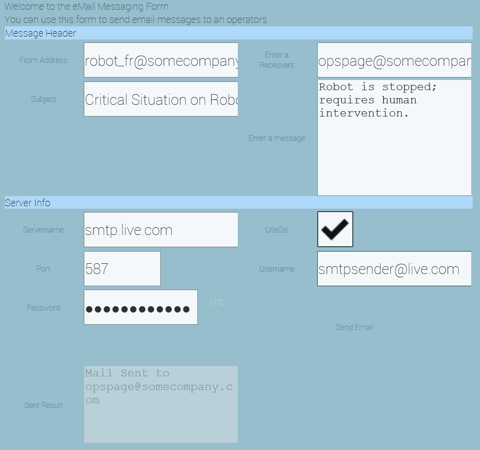

# Messaging Plug-In

## Quickstart

## Quick Disclaimer

Plugins are evolving and the images used in this documentation might not reflect the final state the plugin is in.
Also the colors in the images depend on the skin of the NMI Portal                             

Overview
========

The Messaging Plug-In provides an easy way to send e-mail
notifications to users. It is especially powerful in conjunction with
[the rules engine](https://github.com/TRUMPF-IoT/cdeDocs/tree/master/docs/plugins/149-RulesEngine.md), where you
can use the Messaging Plug-In as a target for a rule so that an e-mail
is sent when the rule conditions are met.

The Messaging Plug-In functionality is also available to
programmatically to accelerate development of other plug-ins.

This Quickstart document describes both the NMI administrator and user
interfaces as well as the structure of the APIs available to developers.

Requirements
============

The Network Status Plug-In requires a C-DEngine based Host, or a
custom application written using the C-DEngine.

You will also need an SMTP or SMTPS server that is accessible from the
Factory-Relay or custom application, as well as corresponding account
credentials and e-mail accounts.

Installation
============

To install your Messaging Service Plug-In onto a C-DEngine-based
Host, follow the plug-in installation instructions in LINK TO COME.

You will see a new tile labeled "Messaging":

> 

Configuration
=============

If you log into the Factory-Relay Portal as an administrator, you will
see a "Messaging Targets" tile, which lets you configure the e-mail
accounts and corresponding SMTP/SMTPS server to which you want to send
notifications from this Factory-Relay. Behind this tile you will see a
table which captures the following information for each message you want
to send:

|Setting|Description
  |----------- |-----------------------------------------------------------------------------------------------------------------------------------------------------
  |Name        |Enter any name that will help you and/or Operators identify what the message is and/or who the recipient is, i.e. Page Night Operator Robot Stopped
  |Recipient   |Enter the e-mail address of the recipient, i.e. opspager\@somecompany.com

One you confirm this information, tap or click on the Details link in
the first column, and you will see a form that captures the information
about the message to send, as well as the SMTP server/accounts to use:

In this form, you enter the following information to describe the
message that you want to send:

  |Setting        |Description
  |-------------- |--------------------------------------------------------------------------------------------------------------------
  |From Address   |The e-mail address that the recipient will see as the "From" address.
  |Recipient      |Enter the e-mail address of the recipient, i.e. <opspager@somecompany.com> (already captured in the initial table)
  |Subject        |The e-mail Subject line that the recipient will see.
  |Message        |The e-mail message text that the recipient will see.

In addition, you need to provide information about the SMTP server to
use for sending the message (Note: In the current version this needs to
be captured for each message/recipient. This will be streamlined in the
future.):

  |Setting        |Description
  |------------- |-------------------------------------------------------------------------------------------------------------------------------------------
  |Server Name   |The host name of the SMTP server to use. For testing, you can use one of the many free SMTP servers, i.e. smtp.live.com.
  |Use SSL       |Check if you want to use SSL to encrypt the communication with the SMTP Server. This is required by all publicly accessible SMTP servers.
  |Port          |The port the SMTP server is listening on. Typically 587 for SMTPS and 25 for plain SMTP.
  |Username      |The username of the account to use when connecting to the SMTP server. \[ i.e. for smtp.live.com, use a Microsoft Account/LiveId \]
  |Password      |The password for the account to use when connecting to the SMTP server.

Once this information is entered, you can tap or click on the "Send
Email" link to send a test message. You will see a result of sending the
test message (success or any error messages) in the "Sent Result" field.

Your message is now ready to be sent as a result of a rule in the Rules
Engine, or from any plug-in that may send notifications directly.

Enter any other messages or recipients you may require. Note that the
actual message text can be generated or modified by a rule (or another
plug-in), so you often do not need more than one rule per target e-mail
address.

Refer to [the rules engine](https://github.com/TRUMPF-IoT/cdeDocs/tree/master/docs/plugins/149-RulesEngine.md) on how to
configure rules in general.

Basic Operation
===============

The Messaging Plug-In is typically not used by operators, but
pre-configured by administrators. Non-administrative users will either
see no tiles in the Messages dashboard, or only see a Tile for the list
of message recipients, but won't be able to modify the list or send
e-mails.

Administrative user will see a tile per message target in the
"Messaging" dashboard, which allows them to manually send messages or
modify the message content or server configuration (as per the previous
section).

Developer Quick Reference
=========================

Plug-in developers can send messages by setting the "SendEmail" or
"Send" property. If the value is an empty string, the pre-configured
message is sent, otherwise the value is used as the message text.

Developers can also access the following properties that correspond to
the fields in the NMI and are described above:

string Recipient\
string SubjectText\
string MessageText\
string FromAddress\
\
string ResultText

string ServerName\
string UserName\
string Password \[ Write-only \]\
bool UseSsl\
int Port

