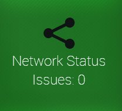
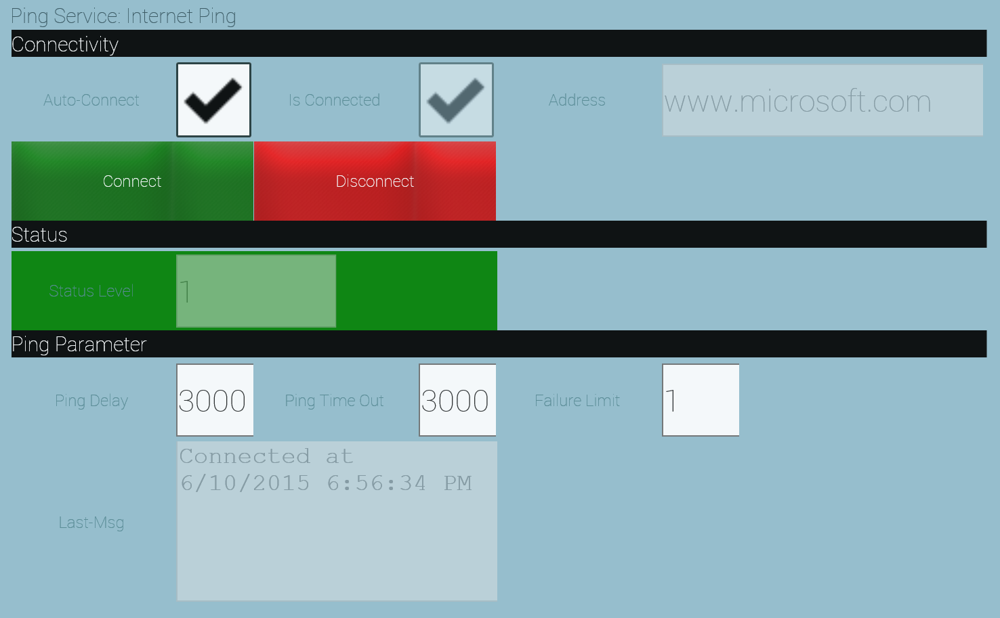

# CDMyNetwork Plugin
                            
## Quick Disclaimer

Plugins are evolving and the images used in this documentation might not reflect the final state the plugin is in.
Also the colors in the images depend on the skin of the NMI Portal 

Overview
========

The Network Status Plug-In lets you monitor network connectivity
from your IoT relay to specific nodes on your network. It is especially
powerful in conjunction with [the rules engine](https://github.com/TRUMPF-IoT/cdeDocs/tree/master/docs/plugins/149-RulesEngine.md), where
you can use the Network Status Plug-In as a source for a rule so that
you take specific actions or provide notifications to users with more
specific information.

The Network Status Plug-In functionality is also available to
programmatically to accelerate development of other plug-ins.

This Quickstart document describes both the NMI administrator and user
interfaces as well as the structure of the APIs available to developers.

Requirements
============

The Network Status Plug-In requires a C-DEngine based Host, or a
custom application written using the C-DEngine.

You will also need at least one other node on your network that responds
to TCP/IP PING messages.

Installation
============

To install your C-Labs File Service Plug-In onto a C-DEngine-based IoT
Relay.

You will see a new tile labeled "Network Status":

Configuration
=============

If you log into the NMI Portal as an administrator, you will
see a "All Network Services" tile, which lets you configure which
network nodes should be monitored and with what frequency. Behind this
tile you will see a table which captures the following information for
each network node you want to monitor:

|Setting|Explanation
  |--------------- |----------------------------------------------------------------------------------------------------------------------------------------------------------------------
  |DeviceType      |Only Ping Service is currently supported, and preselected by default.
  |Friendly Name   |Enter any name that will help you and/or Operators identify which network node is being monitored and/or what the status of the node means, i.e. "Internet Ping 3s".
  |Address         |Enter the DNS name (or local HostName, or IP address) of the network node you want to monitor.

Once you confirm this information, return to the "Network Status"
dashboard. ( If you don't see a tile for the network node you just
added, tap or click the "Refresh Dashboard" tile.)

When you select the tile for the network node, you can then enter
additional information:

*Look and feel might vary depending on plugin version*

In this form, you can start or stop the monitor via the Connect and
Disconnect buttons.

In addition you can see or enter the following information:

| Setting | Explaination
 | ---------------| -----------------------------------------------------------------------------------------------------------------------------------------------------------------------------------------------
 | Address        | The DNS name or IP address for the monitored network node. (Read only)
 | Auto Connect   | Check this if you want the monitor to start whenever the Factory-Relay runs, specifically after a restart.
 | Is Connected   | Indicates if the monitor is running or not (Read Only).
 | Ping Delay     | Time between ping attempts
 | Ping Time Out  | Time after which a ping is considered as failed.
 | Failure Limit  | Number of failed pings after which the monitor is considered to be in failure status (Level 3).
 | Status         | Indicates the current status of the monitor: 0 (Gray) = Inactive,1 (Green) = No Issue. 2 (Yellow) = Ping Failure, but below Failure Limit. 3 (Red) = Ping Failures at or above Failure Limit.

Once you tap or click the "Connect" button, the monitor is active and
its status is shown in the Network Status Dashboard.

A summary status of all monitors is shown in the top-level "Network
Status" tile, indicating the highest status value of all monitors.

You can also use the Network Status monitors in rules in the Rules
Engine, to perform actions (i.e. notify an operator) when the monitor's
status changes. Refer to the [Rules Engine](./149-RulesEngine.md) on how to
configure rules in general.

Basic Operation
===============

The C-Labs Network Status Plug-In is typically only viewed by operators,
and pre-configured by administrators. Non-administrative users will see
the status of individual monitors in the dashboard and in the details
form, but can not change any of the monitor configuration nor add or
delete monitors.

Developer Quick Reference
=========================

Plug-in developers can access the following properties that correspond
to the fields in the NMI and are described above:

+ string Address\
+ bool IsConnected\
+ bool AutoConnect\
+ int PingDelay\
+ int PingTimeOut\
+ int FailureLimit\
+ string LastMessage

