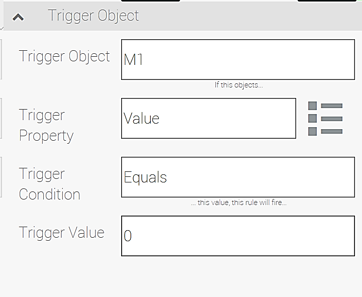
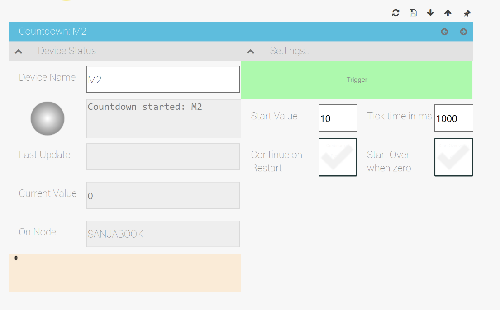
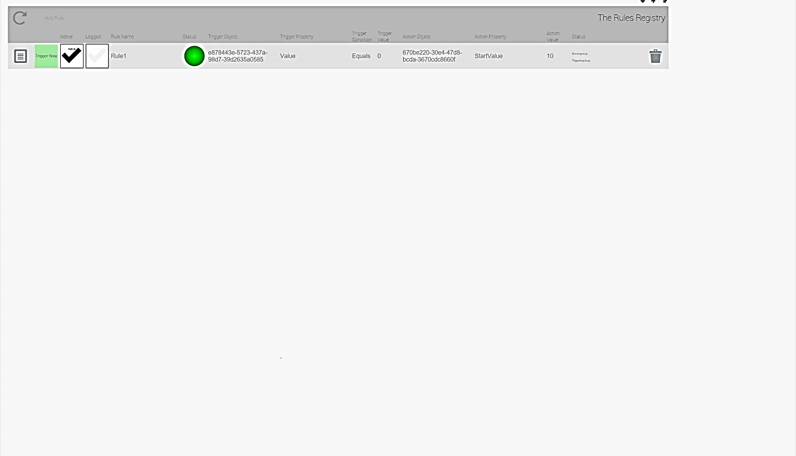

# CDMyRulesEngine Plugin

## Quick Disclaimer

Plugins are evolving and the images used in this documentation might not reflect the final state the plugin is in.
Also the colors in the images depend on the skin of the NMI Portal 

Assumptions
-----------

Following plugins are required to run this example:

-   Messaging Plugin 
-   Virtual Things Plugin
-   [Rules Engine](https://github.com/TRUMPF-IoT/cdeDocs/tree/master/docs/plugins/149-RulesEngine.md)

For more info on Messaging and Virtual Things Plugins, see Appendix A
and B.

About Rules Engine
------------------

Rules Engine Plugin is used to create rules to fully automate some
processes. Rule configuration involves only a few steps:

1) Define trigger object
2) Define Action object
3) Define Action.

Some of the common uses for the Rules Engine are sending notifications
when specified triggers have been triggered.

Rules Engine Plugin Overview
============================

Dashboard Overview
------------------

When the plugin is first loaded, the dashboard will look like this

Figure .:Rules Engine Dashboard

### My First Rule Tile

Clicking on this tile starts the process of configuring first rule. See
section "Setting Up First Rule" for more details.

### The Rules Engine Info Tile

Clicking on this tile opens an "About Page". Version and copyright are
listed here as well as a link to the product brief of the plugin.

### Refresh Dashboard Tile

As the name suggests. Clicking on this tile will send a request to
refresh the dashboard to the relay and it is used to manually update
dashboard.

### Rules Registry Tile

Clicking on this tile will provide user interface to add, edit and
delete rules.

###  Claim Rules Tile

### Event Log Tile

Once you have rules up and running, come back to this tile to see all
logged events.

### Show All Tile

Clicking on this tile displays all rules registered.

My First Rule Form Overview 
---------------------------

To configure your first rule, use **My First Rule Form** pictured below.
Note that this form is grouped into several grouped sections:

-   Rules Status Group
-   Rule Configuration Group
-   Trigger Object Group
-   Action Object Group and
-   TSM Action Group

Figure .: My First Rule Form overview - 5 groups

### Rules Status Group

Most essential information about the rule is in this group. It displays
rule's properties such as: rule name, status, update info, current value
and the owner node of the rule.

Figure .: Rule Status Group

**Device Name**: Editable text field. The device name entered here will
automatically become the name of the rule.

**Status Light and last message text field**:

Last Message Field: Displays last message.

Status Light: represents status state of the rule. Following is a
summary of status sates:

  |**Status Light Color**   |**Status Description**
  |------------------------ |---------------------------
  |Gray                     |Idle (rule is not active)
  |Green                    |Running (rule is active)

Table .: Status Light

**Last Update**: Displays date and time of the last update of the rule.

**Current Value**: Displays value of the rule (where applicable)

**On Node**: Displays Node name

### Rule Configuration Group

Figure .: Rule Configuration Group

**Rule Name:** Editable text field. It is same as "**Device Name"**.

**Activate Rule Checkbox:** Activates / Deactivates rule.

**Log Rule:** When this box is checked, rule will be logged.

**Trigger Now Button:** Triggers the rule

### Trigger Object Group

Figure .: Trigger Object Group

**Trigger Object**: Select to load a lookup table of all available
trigger objects.

**Trigger Property**: Once the Triger Object has been selected and
loaded in the above lookup table, all available trigger properties are
exposed.

**Trigger Condition**: Exposes all available Trigger Conditions (after
trigger object and trigger property have been selected):

  |Trigger Condition   |Description
  |------------------- |-------------------------------------------------------------------------------------------------------------------------------------------------------------------------------------------------------------------------------------------------------------------------------------------------
  |Contains            |Trigger property contains the value specified in "Trigger Value"
  |EndsWith            |Trigger property ends with the value specified in "Trigger Value"
  |Equals              |Trigger property is equal to the value specified in "Trigger Value"
  |Fire                |Fires the action if the property of the trigger object changes, no matter to what it changes to.
  |Flank               |The action will be fired if the trigger property changes between two values specified in the Trigger Value. For example "1,2" fires the action if the property value changes from 1 to 2. Other examples are "3,1", a negative flank when the value in the trigger objects changes from 3 to 1.
  |Larger              |Trigger property is larger than the value specified in "Trigger Value"
  |Not                 |Trigger property is not the value specified in "Trigger Value"
  |Set                 |Trigger property is set to the value specified in "Trigger Value"
  |Smaller             |Trigger property is smaller than the value specified in "Trigger Value"
  |StartsWith          |Trigger property starts with the value specified in "Trigger Value"

Table .: Trigger Conditions Table

**Trigger Value**: Editable text field where the specified variable can
be entered.

### Action Object Group

Figure .: Action Object Group

**Action Object Type**: Defines how the action should be excuted:

-   **Set Property on a Thing** (Default: sets a property of a Thing to
    the "Action Value" specified in the "Thing/Property Action" section

-   Publish Central: sends a message to all nodes in the mesh with the
    given parameters specified in the "TSM Action" section

-   Publish to Service: sends a message to a specific service in the
    mesh

**Delay**: Specify number of seconds of desired delay bevor the action
should be fired after the trigger condition was reached.

\<HEADER\>Thing/Property Action **Action Object**: Select to load a
lookup table of all available action objects.

**Action Property**: Default is: **Value.** Click on "more options
button" to expose all available action properties for the Selected
Action Object.

Figure .: More Options Button

**Action Value:** Editable text box. Specify Action Value here that will
be put in the property of the thing specified above.

### TSM Action

The TSM Action Group is used with "Publish Central" and "Publish to
Service" specified in the Action Object Type to send messages to plugins
in the mesh , therefore when the form first loads, this group will
render in its collapsed state.

Figure .: TSM Action Group

**TSM Engine**: Specify the Target Engine the message will be send to

**TSM Text**:­­­­Specify the command/text (TSM.TXT) of the message.
Target plugins are using this to parse the content of the payload.

**TSM Payload**: specify the payload message

Configuring Example
===================

For this example, we will use combinations of virtual countdown
controls(See Appendix B for information on how to create virtual things)
and the Messaging pluing to send out an email message (see Appendix A
for details on the Messaging plugin)

Rules
-----

To simplify this example, the rules will be kept simple.

In this scenario machines "A, B" and "C" are represented by virtual
countdown controls named "M1", "M2" and "M3". Email recipient was
configured in the Appendix A.

Here's a list of rules we will create:

**Rule \#1:**

When Machine "A" completes counting down from 3,

Machine "B" starts counting down from 10.

**Rule \#2:**

When Machine "B" counts down to 4,

Machine "C" starts counting down from 7.

**Rule \#3:**

When Machine "C" reaches the count of 2,

Message Plugin will send out a notification email.

Setting up rule \# 1
====================

When the Rules Engine Plugin is first installed, you will need to set up
your rules. You can do so in one of two ways:

1: clicking on the "My First Rule" Tile opens a form to easily and
quickly create rules.

2: clicking on the Rules Registry opens an editable table where a new
rule can be created or quick adjustments to the rule can be made.

Figure .: Two ways of configuring rules

Creating Rule 1 using My First Rule Form
----------------------------------------

Rule 1 states:

When Machine "A" completes counting down from 3, Machine "B" starts
counting down from 10.

Configuring a rule requires three steps:

Figure .2: Rule 1 in 3 simple steps

### Step One: Define the rule

Enter name of the rule -- here we keep it simple "**Rule1**". We do want
to activate the rule, so click on the Activate Rule check-box. For the
purposes of this example, we do not need to log this rule.

Figure .3: Step One: Define the Rule

### Step Two: Define Trigger Object

Trigger Object refers to the object we want to monitor. In Rule 1,
that's Machine "A" (**M1**), specifically, we need to monitor its
Trigger Property: **Value**. We are monitoring for the countdown to be
complete and **M1** has reached the count of zero (M1**=** **0**).
Trigger Condition: **Equals** and Trigger Value: **0**.

Figure .4: Step Two: Define Trigger Object

###  Step Three: Define Action Object

Action Object in this case is Machine "B" (**M2**). Action Object Type:
**Set Property on a Thing**. Since Machine B "M2" should wait to operate
until "M1" has completed its work, Action Property we can use here is:
**StartValue**, and set that Action Value to: **0**. We will delay this
process by 2 seconds.

Figure .5: Step 3: Define Action Object

Testing Rule \#1
================

You are now ready to test your first rule.

Follow these steps to create a view that has been optimized to observe
rule 1.

1.  **Pin M2 Detail Form**

-   In the AXOOM Gate Dashboard **click on the Virtual Things Tile**.
    This opens the plugin and displays a list of all available virtual
    things we created so far: M1, M2 and M3.

Figure .: Click on Virtual Things Tile in the list of Services in
AXOOM-Gate

Because C-DEngine uses flow style of elements in similar ways HTML does,
we will begin creating our test rule 1 view from right to left. For this
we will use pin icons in the top right corner of the screen.

-   In the Virtual Things Dashboard, **click on the M2** countdown
    control.

> Figure .: Virtual Things Plugin Dashboard

This opens M2 detail sheet. Click on the **Settings Collapsible Tab** to
expose settings option.

Figure .: Countdown: M2 detail sheet and Settings tab open

By doing this, we expose the Trigger Button in the Setting Tab. We will
use this later in the test.

Once the form is fully expanded, click on the "Decrease window width" (a
left pointing arrow) button at the right side of the Countdown blue
header.

Figure .: Decrease Window Width Button

This decreases the width and increases the height of the window, as
pictured below:

Figure .: M2 detail sheet ready to pin

To add another item -- click on the logo in the top left corner: (this
brings back the dashboard and shows all thigs pinned to the dash.

Figure .: Home Button

Once you M2 Detail Form has been pinned to the dashboard, it will look
like
this:Figure .: M2 Detail Form Pinned to Dashboard

2.  **Pin M1 Detail Form**

Following the same directions as pinning M2 detail form, pin the M1
detail form to the dashboard. Result will look like this:

Figure .: M1 and M2 Detail Forms Pinned

3.  **Pin My First Rule Form**

As before, click on the home button, as this shows all installed plugins
and all pinned items. Click on the Rules Engine Tile:

Figure .: Rules Engine Tile

This opens Rules Engine Dashboard and shows the "My First Rule" Tile at
the top. Click on it to open My First Rule Detail Form.

Once you open the My First Rule Detail Form, your dashboard will look
like this:

Use the Pin down button above the My First Rule Detail Form to complete
Rule 1 view.

Save this view by clicking on the "Save View" button:

Figure .: Save View Button

To test if Rule 1 works -- click on the Trigger Button on Countdown:M1.
You can observe the current Value and Status lights change as the test
progresses.

Creating Rule 2
===============

Rule 2 states:

When Machine "B" counts down to 4, Machine "C" starts counting down from
7.

Configuring a rule again requires three steps:

Figure .2: Rule 2 in 3 simple steps

Configuring Rule 2 using editable table in the Rules Registry Table
-------------------------------------------------------------------

In previous example, we used My First Rule Form to configure Rule 1.

Here is how to configure a rule using an Rules Registry Table. See
**Figure 3.1: Two ways of configuring rules**, to locate Rules Registry
Tile.

### Rules Registry Dashboard

Clicking on the Refresh button in the Rules Registry, lodes all
configured rules.

Figure .: Refreshed Rules Registry Lookup table

Click on the Add Rule Button in the top left corner. See *Figure* *6.2:
Add Rule Button*

Figure .: Add Rule Button

### Creating a new rule using editable lookup table

Rules can be created / edited in the lookup table.

Figure .: Create Rule Lookup table

Start by clicking on the **Active** checkbox, leave Logged checkbox
empty (as we do not require logs).

Enter **Rule 2** as the name of the rule, and click on the Trigger
Object lookup field. Click on **SELECT** button to load options. Click
on the Trigger Object lookup filed again and locate **Countdown**
control named **M2**. Leave a default for Trigger Property: **Value,**
and click on the Trigger Condition lookup field, select : **Equals.**
Action Value:**4**. Next, define Action Object:**M3,** enter Action
Property: **StartValue** and ActionValue:**7.**

Figure . : Rule 2 in Rules Registry Lookup Table

Testing Rule 2
==============

This time, we can create a different view to optimize watching the
testing in process. Start by pinning Countdown control M3 first. Then
add M2 and M1.

Clicking on the home button, displays your dashboard and pinned
countdown controls. We can also add Rules Registry lookup table to the
view, by pinning it above the countdown controls.

Figure .: Testing Rule 2

To test if Rule 2 works -- click on the Trigger Button on Countdown:M1.
You can observe the current Value and Status lights change as the test
progresses starting with M1, continues to M2 and ending with M3 counting
down from 7.

Creating Rule 3
===============

Rule 3 states:

When Machine "C" reaches the count of 2, Message Plugin will send out a
notification email.

Configuring a rule again requires three steps:

Figure .2: Rule 2 in 3 simple steps

Configuring Rule 3 using a combination of lookup table and detail form
----------------------------------------------------------------------

Start by clicking on Add Rule Button in the Rule Registry lookup table:

Figure .: Add Rule Button

This opens editable fields within the table. Click on the Active Rule
checkbox, leave Log Rule deselected. Load the lookup table and select
Countdown **M3** as Target Object, Trigger Property will remain
unchanged: **Value**. Select Trigger Object: **Equals.** Set Trigger
Value to:**2.**

Load the Action Object into the lookup table and select: **eEmail
Message** (you created this in Appendix A). Leave Action Property
unchanged: **Value.** Message to be sent is entered for Action Value,
which in this case will be: **Process M1, M2 and M3 complete.** Click on
the save button in the top right corner.

After clicking save button, screen should look like this:

Figure .: Shortcut to Rule 3 Detail Form

There are a few things that need to be edited in the Action Object, and
to do so -- just click on the Rule 3 Detail Form Button, at the bottom
of The Rule Registry table.

This moves your view down and displays Rule 3 Detail Form on top of the
screen. Add this form to your view by clicking on the pin down button.

Notice that Action Object Type has been automatically populated: Publish
Central. Click on that field to change it to: **Set Property On a
Thing**. Change Action Property from Value to: **sendmail.** In the
Action Value field enter your message: **Process M1, M2 and M3
complete.**

Figure . : Rule 3 Detail Form

Testing Rule 3
==============

To test all three rules, scroll down to machine detail forms and Trigger
M1 countdown. You can monitor the progress of the rules by observing
Countdown control status lights and their current value. At the end of
the test, make sure you check your email for your notification email.

Figure . : Testing Rule 3 Screenshot
