# Welcome to the C-DEngine Plugins
---
In this repository, you will find a collection of plugins created specifically for the C-Labs™ C-DEngine™ that offer a variety of IoT-related features.  Each plugin here accomplishes a specific function, such as interacting with a sensor, storing values in a database, or sending data to an additional cloud service.  Sometimes, multiple plugins can be combined to produce a completely unique solution.

This Getting Started Guide walks you through the installation of a plugin on your node and provides examples of how to use certain plugins.

You can find the plugins mentionend in this document in the plugin depot: https://github.com/TRUMPF-IoT/C-DEPlugins

Have fun and be creative!

## Table of Contents

- [Getting Started](#getting-started)
  - [Installing a Plugin for Users](#plugin-users)
  - [Installing a Plugin for Developers](#plugin-developers)
- [Using Plugins](#using-plugins)
  - [Virtual Things - C-DMyVThings](#virtual-things)
  - [Network - C-DMyNetwork](#network)

# Getting Started<a id="getting-started"></a>

## Installing a Plugin for Users<a id="plugin-users"></a>

If you are running a C-DEngine host as a standalone executable or Windows service (i.e. not debugging with Visual Studio) or running a C-Labs product such as the Factory-Relay Machine Monitor or Axoom Gate, follow these steps to install a plugin.

> If you are running a Console Application host and debugging with Visual Studio, skip to the next section "Installing a Plugin for Developers".

1. Obtain a .CDEX file for the plugin.  These are zip files with a special C-DEngine extension that contain all necessary .dlls for the plugin.

- Pre-packaged plugins are available in the [Release artifacts](https://github.com/TRUMPF-IoT/C-DEPlugins/releases) of the C-DEPlugins depot.

- If you are attempting to install a custom plugin, you must create the .CDEX yourself or use the packager to do it for you.  Skip to the next section "Installing a Plugin for Developers" for a tutorial on this. 

- If you have access to the source code for a plugin in the Plugins repository, a .CDEX will likely be created after building the project once.  The .CDEX can be found under the plugin folder's `bin\Debug\store\[Plugin ID]\[Platform]`.

2. Navigate to the host folder.  For C-DEngine products, this is typically `C:\Program Files (x86)\C-Labs\[Product Name]` for 64 bit and `C:\Program Files\C-Labs\[Product Name]` for 32 bit.

- Now open the folder `\ClientBin\Updates`.  If the Updates folder does not exist, create it.

3. Copy over the .CDEX into the Updates folder and restart the executable or Windows service. 

- On restart, the host will read the Updates folder and extract the .dll(s) of the plugin into the working directory.

### The plugin is now installed! 

- If your plugin has a UX, its dashboard should now be visible after logging into the NMI of your host.  This is typically reachable at `http(s)://[Host domain]:[Host port]/nmiportal` or `http(s)://[Host domain]:[Host port]/nmi`. 

## Installing a Plugin for Developers<a id="plugin-developers"></a>

If you are running a Console Application host, debugging with Visual Studio, and have access to the source code (class library) of the plugin, follow these steps to install it.

1. Locate the host application project. Right-click on the project's References. Select **Add Reference…** from the popup menu.

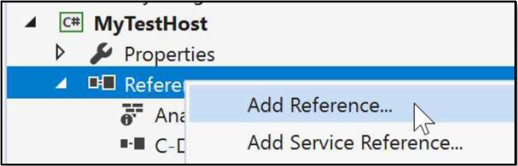

2. In the Reference Manager dialog, select **Projects | Solutions** on the left panel.

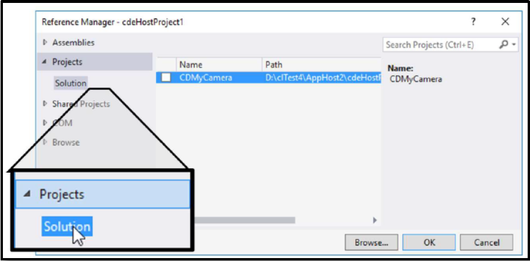

3. In the **Reference Manager** dialog, click the checkmark next to your plugin. Click **Ok**. Check that the plugin project name appears in host application project References.

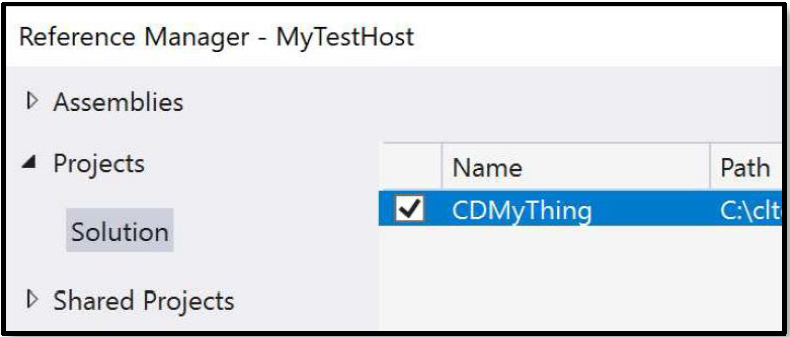

### The plugin is now added to the host!

To create a .CDEX for the plugin (referenced in the above section "Installing a Plugin for Users"), use the following steps:

### Generating a .CDEX
The cdePackager is a project in the C-DEngine directory that "packages" plugins into .CDEX files.  You can use this project to create the .CDEX files for your plugin automatically every time the plugin project is built.  Simply add these lines to the end of your plugin's .csproj file:
```
<Target Name="PostBuild" AfterTargets="PostBuildEvent">
    <Exec Command="call &quot;$(ProjectDir)..\..\..\BuildTools\signandpackage.cmd&quot; &quot;$(ProjectDir)&quot; &quot;$(TargetDir)&quot; &quot;$(TargetFileName)&quot;&#xD;&#xA;" />
</Target>
``` 

Ensure that the path to the `signandpackage.cmd` is correct.  Here it is set to `$(ProjectDir)..\..\..\BuildTools\signandpackage.cmd`, but depending on the working directory of your plugin, this may be different.

> **NOTE:**
While the packager is  the recommended method of .CDEX generation, you can also create a .CDEX manually. Place all of the necessary .dlls for your plugin into a zip file, then rename the zip file to "[Plugin Name]-[Engine Name] V[Version Number].CDEX".  E.g. CDMyVThings-TheVThings V4.2050.CDEX.  The extension of the file must be .CDEX instead of .zip and the engine name is typically the name of your plugin service's class unless explicitly changed.

# Using Plugins<a id="using-plugins"></a>

Here we provide some simple example plugins that you can start using in order to become familiar with the way plugins work in the C-DEngine.

## Virtual Things - C-DMyVThings<a id="virtual-things"></a>

The Virtual Things plugin provides the ability for a user to create any number of "virtual", or "software-only" devices that each have unique functions.  

For example, a user can create a "Countdown" Thing, which decrements its value starting at a configurable number on a defined interval.  You might use this as "test data" to feed into another plugin, or trigger a rule every time the countdown reaches 0 with the Rules Engine plugin.  There are many possibilities.

In order to use the Virtual Things plugin:

1. First install it using one of the methods described above.  Navigate to your NMI portal and login using your credentials or scope ID.

2. You should now see a dashboard tile titled "Virtual Things".  Click on it.

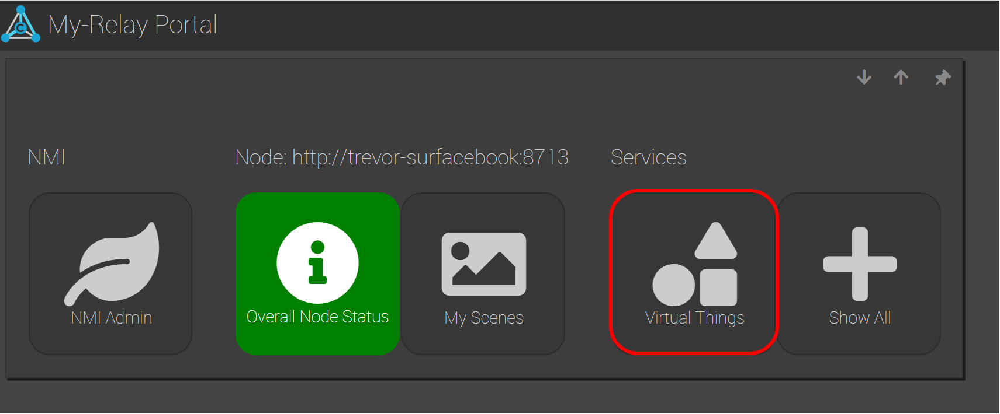

3. Now click on the table "V-Things List".

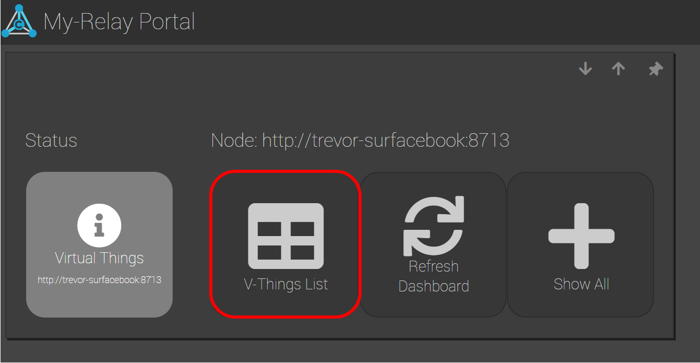

4. Create a new Virtual Thing by clicking "Add V-Thing".  A new row will appear in the table. Provide a **Friendly Name** and select the **Device Type** of the Thing.  In this example, we select *Countdown*.

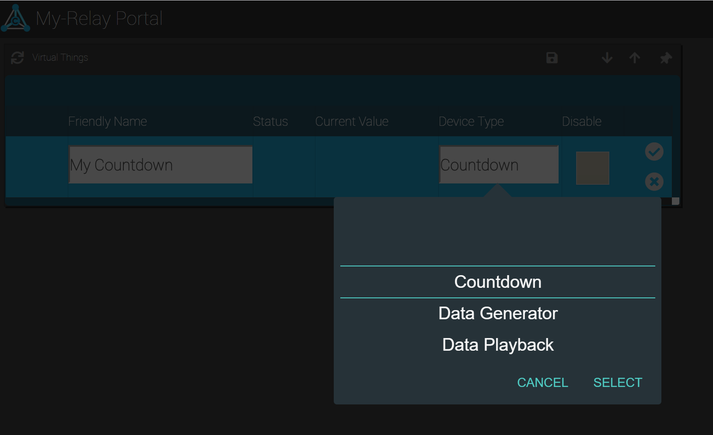

> **NOTE:**
You will often see tables like this throughout the NMI.  This is the standard way of managing a collection of Things.  Each table will look similar, but will contain different configurable properties (columns) depending on the type of Thing.

5. Click the check mark to finish creating the V-Thing.  There should now be a new row visible in the table.  Click the form icon on the far left of the row to open up the details of the V-Thing.

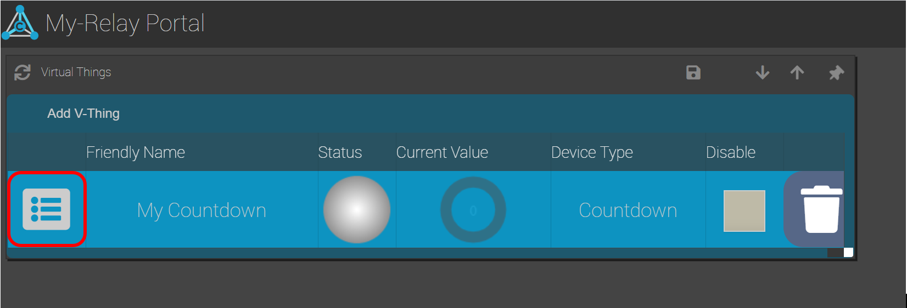

6. Each V-Thing you create will have its own form with additional properties that you can configure to change its behavior.  For the Countdown, observe that you can change the **Start Value** and **Tick Time**, as well as specify whether it should start over when it reaches zero, and continue on restart of the node.  Clicking the "Trigger" button will start the Countdown.
 
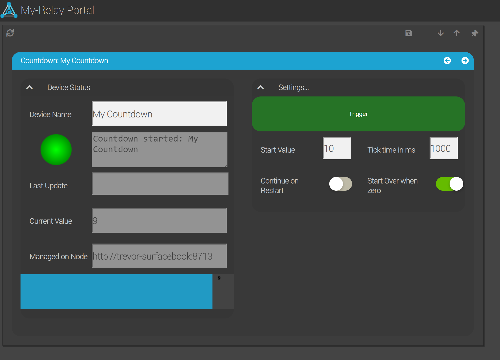

7. Experiment by changing these properties and creating other types of Virtual Things as well!

As a reference, here are descriptions of each type of Virtual Thing you can create:

| Device Type | Description |
|-------------|-------------|
| Virtual Sensor | Consumes a single property from a selectable thing into the VSensor thing (Value property), and represents it as a sensor using the default sensor template (chart, units, moving min/max/avg etc.) |
| Virtual State Sensor | Consumes a single property from a selectable thing and generates a single numerical state (typically on/off) from it's value through configurable mechanisms. |
| Data Player | This device type of the VThings plug-in lets you play thing updates from a log file (i.e. a mesh sender data log file) into one or more things. |
| Countdown | Decrements a value starting at a selected number on a defined interval (in milliseconds). |
| Sine Wave Generator | Generates data points of a continuous sine wave with a configurable amplitude, step, shift and tick time. |
| Memory Tag | Creates a memory location in a Thing that can be used to store or modify sensor data |
| NMI Element | creates a new NMI Element that can reference any Thing/Property in the system |
| Data Generator | can create data to be consumed by other things |
| Data Verifier | can verify data created by other things |

See the **C-DMyVThings** README file for more information.

## Network - C-DMyNetwork<a id="network"></a>

The Network plugin allows you to create multiple services that ping desired IP addresses or URLs on a defined interval. You can quickly monitor which devices and servers on your network are reachable from your node and which ones aren't. 

In order to use the Network plugin:

1.  First install it using one of the methods described above.  Navigate to your NMI portal and login using your credentials or scope ID.

2. You should now see a dashboard tile titled "Network Status Issues: 0".  Click on it.  Note that since we have not created a Network Service yet, there are 0 issues and the tile is gray. 

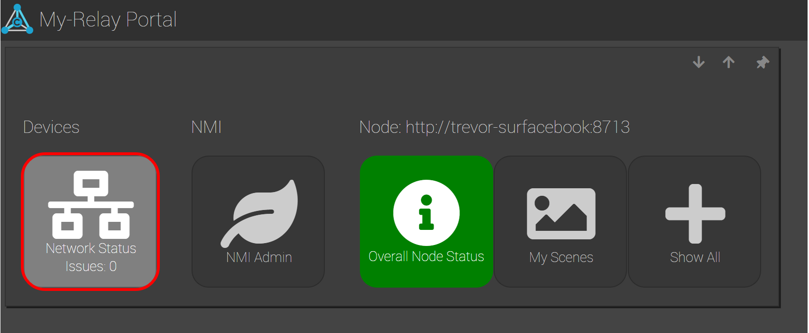


3. Now click on the tile labeled "Add new Network Service".  In the NMI, this is what is known as a "Wizard", which leads you through a step-by-step process to create a Thing.  However, creating a new service in the "Network Services" table will also lead to the same result.

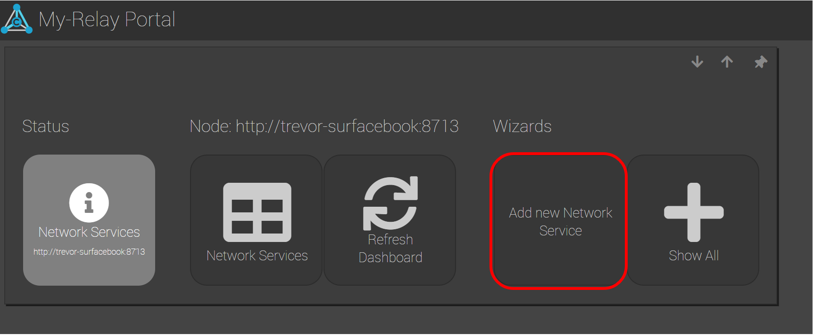


4. Fill in the details of the Network Service.  As an example, we will ping google.com.  Provide a name, set the **Service Type** to "Ping Service" and set the **Address** to "google.com".  Click "Finish" when you are done.

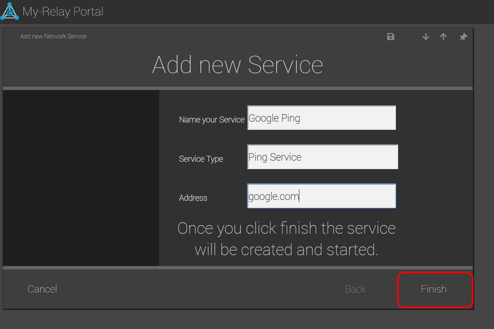


5. Now observe the newly created Network Service tile on the plugin's dashboard.  The tile should be green if the service can successfully reach google.com.

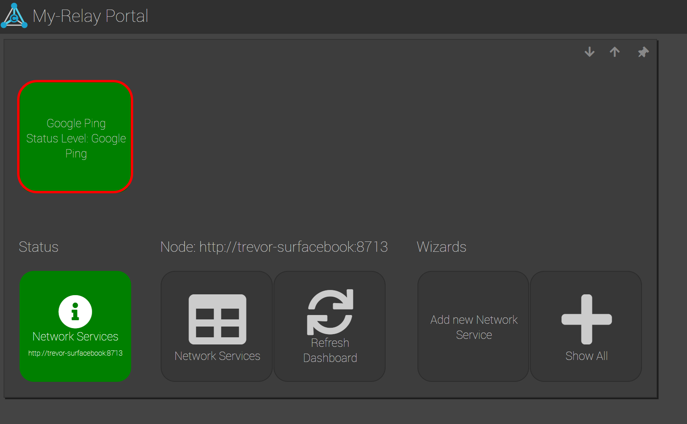


6. Click on the service's tile and notice the configurable properties.  The **Ping Delay** sets the time (in milliseconds) in between pings, the **Ping Time Out** sets the amount of time to wait for a response before considering the ping failed, and the **Failure Limit** sets how many times the ping can fail before considering the **Address** unreachable (and turning the status light to red).

- The **Trip Time** will consistently update with the number of milliseconds it took to receive a response back from the **Address**.

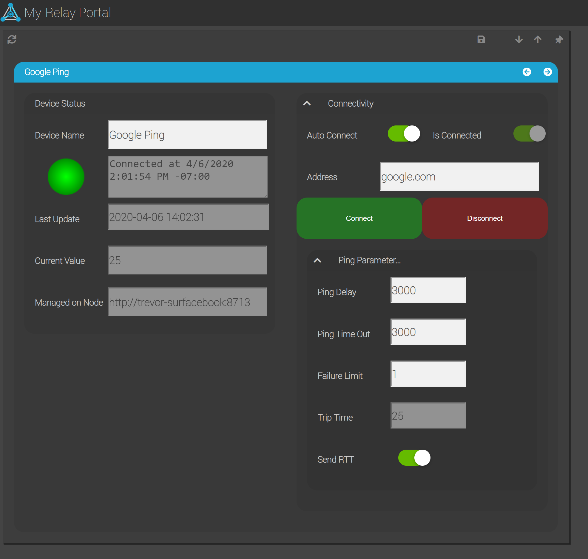

---
Although each C-DEngine plugin is different, most follow a similar style in the NMI, often consisting of some or all the following elements:

- A table to allow creation and/or management of one or more "Things"
- A Wizard that walks through a step-by-step process of Thing creation
- A Settings form for configuration of each Thing's properties
- A Settings form for overall plugin configuration

Some plugins have additional README files to explain usage.  

